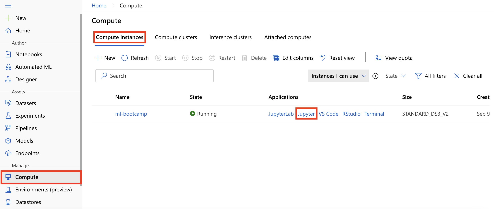
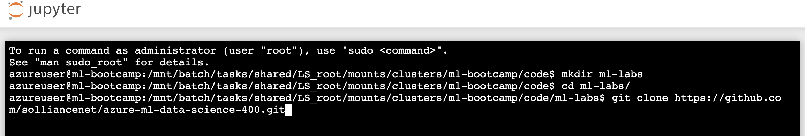

# Setup Lab 01

**Contents**

<!-- TOC -->

- [Lab Setup](#lab-setup)
   - [Task 1: Create a Compute Instance](#task-1-create-a-compute-instance)
   - [Task 2: Import the Lab Notebooks](#task-2-import-the-lab-notebooks)
- [Additional Lab Requirements](#additional-lab-requirements)

## Lab Setup

### Task 1: Create a Compute Instance

In this task, you add a compute resource to your Azure Machine Learning workspace.

1. On the Machine Learning blade in the [Azure portal](https://portal.azure.com/), open Azure Machine Learning studio by selecting **Launch studio** from the center section of the screen.

   

2. In the new Azure Machine Learning studio window, select **Create new** and then select **Compute instance** from the context menu.

   

3. On the create compute instance screen, enter the following information and then select **Create**:

  - - **Compute name**: Enter `ml-bootcamp-SUFFIX`, where SUFFIX is your Microsoft alias, initials, or other value to ensure uniquely named resources.
   - **Virtual machine type**: Select `CPU`.
   - **Virtual machine size**: Select `Select from recommended options` and then select `Standard_DS3_v2`.

   

4. Wait for the Compute Instance to be ready. It takes approximately 3-5 minutes for the compute provisioning to complete.

### Task 2: Import the Lab Notebooks

In this task, you import Jupyter notebooks from GitHub that you will use to complete the exercises in this hands-on lab.

1. From within Azure Machine Learning studio navigate to **Compute, Compute instances**, and then select **Jupyter** link to open Jupyter Notebooks interface for the compute instance **ml-bootcamp-SUFFIX**.

   

2. Check **Yes, I understand** and select **Continue** in the trusted code dialog.

   

3. In the new Jupyter window, select **New** and then select **Terminal** from the context menu.

   

   > **Note**: If you see errors when loading terminal, you will have to first run `cd ~/cloudfiles/code/Users/<username>` before proceeding.
  
4. Run the following commands in order in the terminal window:

   - `mkdir ml-labs`
   - `cd ml-labs`
   - `git clone https://github.com/solliancenet/azure-ml-data-science-400.git`

   > **Note**: If you have two-factor authentication set up on your GitHub account, you have to use a PAT as the password.

   

5. Wait for the `clone` command to finish importing the repo.

## Additional Lab Requirements

The lab will create the following resources on the fly and thus we need to ensure necessary quota for the lab user.

- AML compute cluster vm_size='Standard_DS12_v2', max_nodes=2
- ACI container cpu_cores=3, memory_gb=15
- AKS cluster Standard_D3_v2 (default is 3 nodes)
