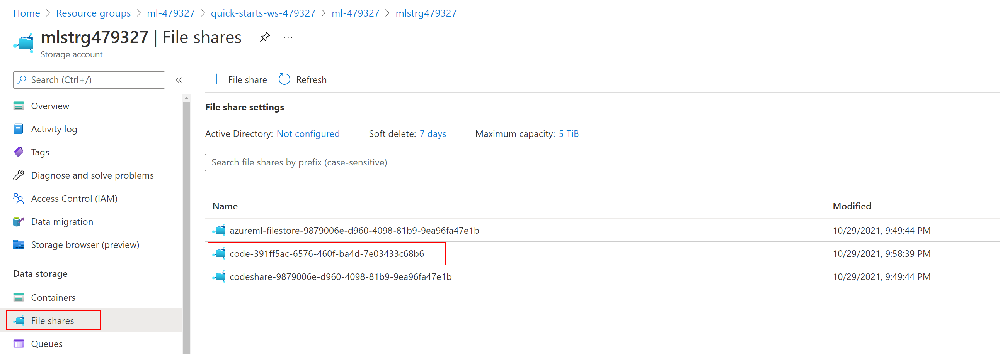

# Setup Lab 01

**Contents**

<!-- TOC -->

- [Setup Lab 01](#setup-lab-01)
  - [Lab Setup](#lab-setup)
    - [Task 1: Create a Compute Instance](#task-1-create-a-compute-instance)
    - [Task 2: Import the Lab Notebooks](#task-2-import-the-lab-notebooks)
  - [Additional Lab Requirements](#additional-lab-requirements)

## Lab Setup

### Task 1: Create a Compute Instance

In this task, you add a compute resource to your Azure Machine Learning workspace.

1. On the Machine Learning blade in the [Azure portal](https://portal.azure.com/), open Azure Machine Learning studio by selecting **Launch studio** from the center section of the screen.

   

2. In the new Azure Machine Learning studio window, select **Create new** and then select **Compute instance** from the context menu.

   

3. On the create compute instance screen, enter the following information and then select **Create**:

  - - **Compute name**: Enter `ml-bootcamp-SUFFIX`, where SUFFIX is your Microsoft alias, initials, or other value to ensure uniquely named resources.
   - **Virtual machine type**: Select `CPU`.
   - **Virtual machine size**: Select `Select from recommended options` and then select `Standard_DS3_v2`.

   

4. Wait for the Compute Instance to be ready. It takes approximately 3-5 minutes for the compute provisioning to complete.

### Task 2: Import the Lab Notebooks

In this task, you import Jupyter notebooks from GitHub that you will use to complete the exercises in this hands-on lab.

1. In the storage account associated with the Azure Machine Learning workspace, identify the `code` file share (it's the one named `code-xxxxxxxx-xxxx-xxxx-xxxx-xxxxxxxxxxxx`).

   

2. Ensure the file share contains a folder named `Users`. Inside that folder, ensure there exists a folder named `odl_user_xxxxxx`.

3. Inside the `odl_user_xxxxxx` folder, create a folder named `day-03`.

4. Inside the `day-03` folder, copy the entire contents of the `notebooks` folder found under the `day-03` folder in the GitHub repo.

   The final folder structure must be the following:

   

## Additional Lab Requirements

The lab will create the following resources on the fly and thus we need to ensure necessary quota for the lab user.

- AML compute cluster vm_size='Standard_DS12_v2', max_nodes=2
- ACI container cpu_cores=3, memory_gb=15
- AKS cluster Standard_D3_v2 (default is 3 nodes)
