# Setup the Lab 06 Workspace

## Task 1 - Configure the Azure DevOps project and required Variable group

1. Open the [Azure DevOps portal](https://dev.azure.com/) and select the **Sign in to Azure DevOps** link.

    

2. To sign-in, use the Azure credentials provided by the lab environment.

3. First time you sign-in to your Azure DevOps account, you are asked to create a new project in the pre-created organization you have available, named `odluserXXXXXX`. Provide the project name in the following form `odluserXXXXXX-project` and select **+ Create project**

    

>Note: Please make sure you check the pre-installed extensions at >AzureDevOps organization level: 

4. MLOpsPython requires some variables to be set before you can run any pipelines. At this step, you'll create a variable group in Azure DevOps to store values that are reused across multiple pipeline stages. Navigate to **Pipelines**, **Library** and in the **Variable groups** section select **+ Variable group** as indicated bellow.

    

5. To prepare the values you'll need to set all your variables, you need to get the resource group location where all your Azure resources were provisioned. In another browser tab, navigate to the [Azure portal](https://portal.azure.com), sign in with the provided Azure credentials if you are asked to, and navigate to the lab Resource group. On the resource group overview page, you'll find the location information you need.

    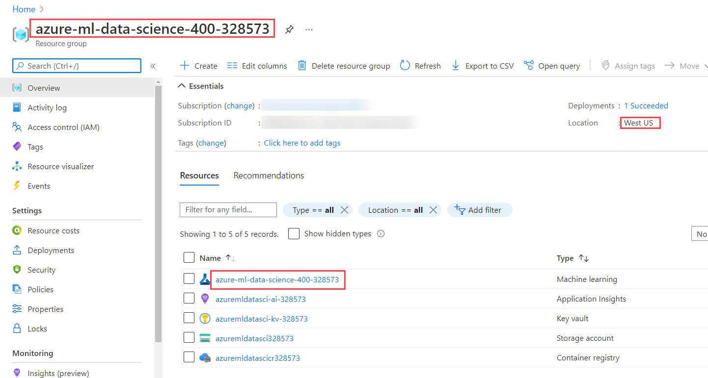

    Also note the other two marked values in the image above (you'll also need those two on the next steps): the **Resource Group name** and the **Machine Learning Workspace name**, which are also provided for you in the lab Environment Details page.

6. Going back to the Azure Devops portal where you created the Variable group for you DevOps project, enter the **Variable group name**: `devopsforai-aml-vg`.

7. Add the required list of variables, using the **+ Add** link at the bottom of the **Variables** section as illustrated in the image bellow:

    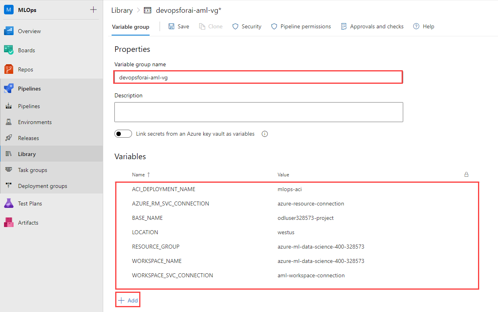

    Use values listed in the table:

    | Variable Name            | Suggested Value           | Short description                                                                                                           |
    | ------------------------ | ------------------------- | --------------------------------------------------------------------------------------------------------------------------- |
    | BASE_NAME                | [your project name] e.g. `odluserXXXXXX-project`     | Unique naming prefix for created resources - max 10 chars, letters and numbers only                                         |
    | LOCATION                 | `westus`                 | Resource group location (the value you looked for on the previous step)                             |
    | RESOURCE_GROUP           | `AI-in-a-Day-XXXXXX`                | Azure Resource Group name                                                                                                   |
    | WORKSPACE_NAME           | `ai-in-a-day-XXXXXX`             | Azure Machine Learning Workspace name                                                                                                     |
    | AZURE_RM_SVC_CONNECTION  | `azure-resource-connection` | Azure Resource Manager Service Connection name |
    | WORKSPACE_SVC_CONNECTION | `aml-workspace-connection`  | Azure ML Workspace Service Connection name                 |
    | ACI_DEPLOYMENT_NAME      | `mlops-aci`                 | [Azure Container Instances](https://azure.microsoft.com/en-us/services/container-instances/) name                           |                 |

8. Make sure you select the **Allow access to all pipelines** checkbox in the variable group configuration.

    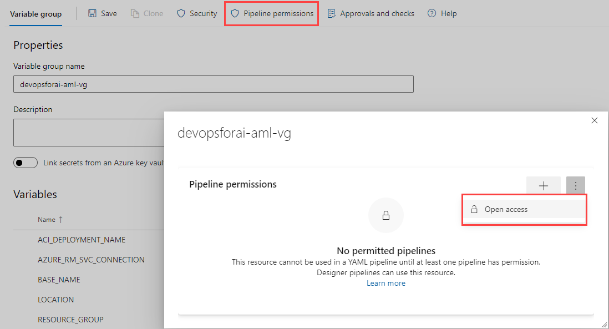

9. Select **Save** from the top menu to create the variable group.

    

## Task 2 - Create an Azure DevOps Service Connection for the Azure ML Workspace

Create a new service connection to your Azure ML Workspace to enable executing the Azure ML training pipeline. The connection name needs to match the WORKSPACE_SVC_CONNECTION that you set in the variable group above (e.g. `aml-workspace-connection`).

1. Go to **Project settings**, **Service connections** and select **Create service connection** as illustrated bellow.

    

2. Select the connection type from the available list: **Azure Resource Manager** and select **Next**.

    

3. Provide the authentication method: **Service principal (automatic)** and move **Next**.

    

4. Select scope level: **Machine Learning Workspace** and select the available **Subscription**, **Resource group** and **Machine Learning Workspace** provided in the lab environment. Enter `aml-workspace-connection` for the **Service connection name** and select **Save**.

    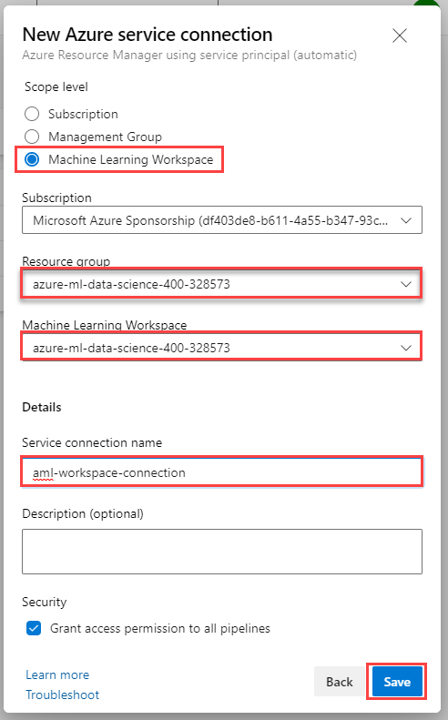

>Note:
>
>Creating a service connection with Azure Machine Learning workspace scope requires `Owner` or `User Access Administrator` permissions on the Workspace. You'll need sufficient permissions to register an application with your Azure AD tenant, or you can get the ID and secret of a service principal from your Azure AD Administrator. That principal must have Contributor permissions on the Azure ML Workspace.

## Task 3 - Import the GitHub repository

1. Go to the [GitHub portal](https://github.com/) and sign in with the Git credentials provided for you.
2. You will be asked to verify your account, so you should open your user's mailbox on https://outlook.office365.com/ to be able to receive the verification codes for GitHub authentication. Use the same GitHub user account credentials to open Outlook.

3. In GitHub, while authenticated with the lab user, navigate to the following link to create a new git repository from the provided template:
   https://github.com/solliancenet/azure-ai-in-a-day-lab-02-starter/generate

4. Set the repository name to `azure-ai-in-a-day-lab02` and select **Create repository from template**.

    

5. When the new repository is generated, copy your repository URL from the browser address bar since you will need it in the next steps.


## Task 4 - Set up Build, Release Trigger, and Release Multi-Stage Pipelines

Now that you've provisioned all the required Azure resources and service connections, you can set up the pipelines for training (CI) and deploying (CD) your machine learning model to production. Additionally, you can set up a pipeline for batch scoring.
In the following steps you will create and run a new build pipeline based on the `COVID19Articles-CI.yml` pipeline definition in your imported repository.

1. In your Azure DevOps project summary page, navigate to the **Pipelines** section from the left navigation menu. Select **Create Pipeline**.

    

2. Select the code location: **GitHub**.

    

3. Next you will be asked to authorize Azure Pipelines to access your GitHub account. If prompted with the GitHub sign in page, provide the GitHub credentials listed in the lab environment credentials page.

    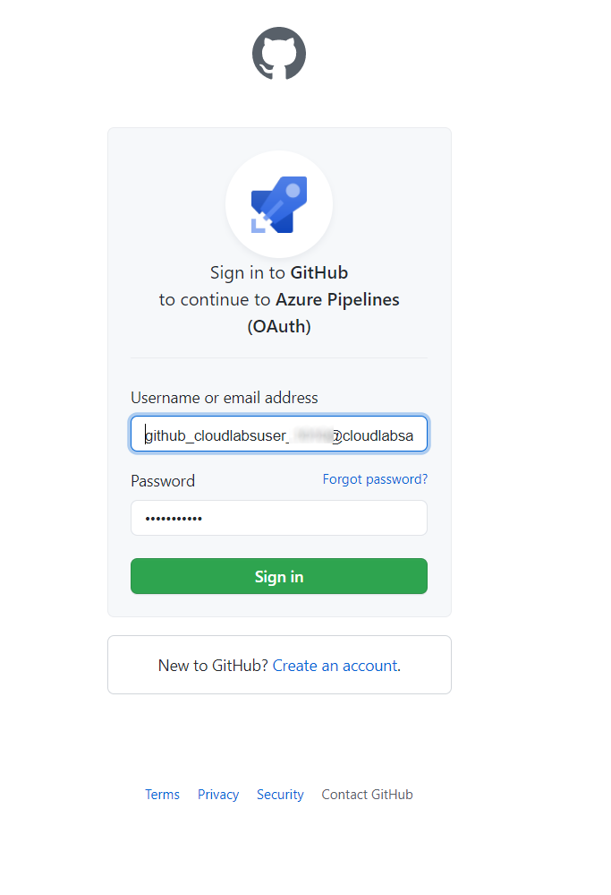

4. If you are already signed in to GitHub, you will be prompted with the Authorize Azure Pipelines (OAuth) page. Select **Authorize AzurePipelines**.

    

5. Redirected back to Azure Devops, select the available Git repository, the one you generated during the previous task in this lab: `github-clouduser-XXXX/azure-ai-in-a-day-lab-02`.

    

6. After you authorized the access for Azure Pipelines, you'll be asked to approve and install Azure Pipelines on your personal GitHub account. Select the `azure-ai-in-a-day-lab02` repository and select **Approve & Install**.

    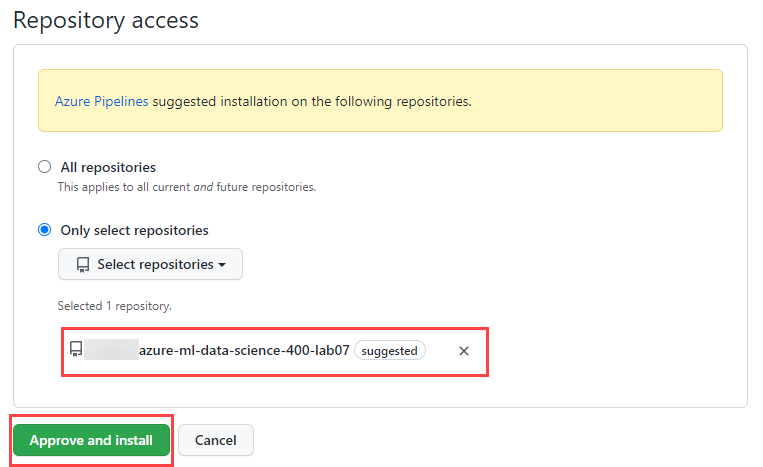

7. After approving installation, you might be asked to sign in again to Azure Devops, so you have to provide the Azure credentials provided in the lab environment. Next, in case you are asked, you will have to authorize Azure Pipelines permissions on your GitHub account. Select **Authorize Azure Pipelines** on this page.

    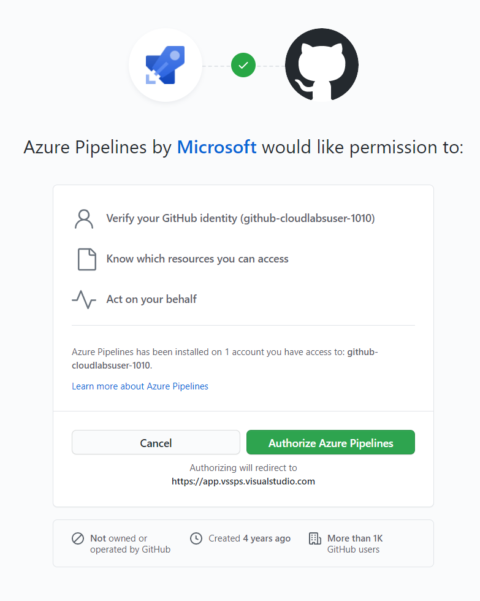

8. Back to Azure Devops, in the **Configure pipeline** step, select the **Existing Azure Pipelines YAML file**.

    

9. Leave the default branch selected and paste the path to the YAML file: `/.pipelines/COVID19Articles-ci.yml`. Select **Continue**.

    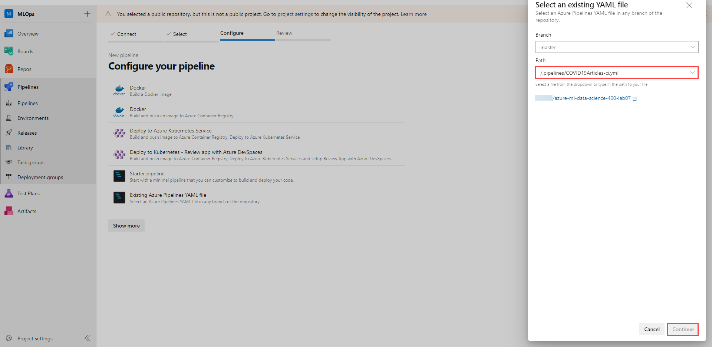

10. In the **Review** step, take a moment to observe the code inside the YAML file and then expand the **Run** menu and select **Save**.

    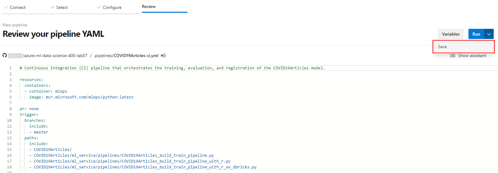

11. With the created pipeline, select **Rename/move** from the right menu as illustrated bellow:

    

12. Change the pipeline name to: `Model-Train-Register-CI` and select **Save**.

    

13. Run the pipeline by selecting the **Run pipeline** button. Leave the default values on the next dialog and hit **Run**. Wait for the pipeline run to complete (it can take up to 20-25 minutes for the pipeline to finish).

    

>Note
>
>While waiting for the CI pipeline to finish, given that it will take 20-25 minutes to complete, you can move on with steps 1 to 9 in the next task to create the release deploy pipeline. Note that you cannot run this second pipeline until the first one is not completed. When both pipelines are created, the CI pipeline triggers the start of the CD one.

## Task 5 - Set up the Release Deployment pipeline

1. Open the [Azure DevOps portal](https://dev.azure.com) and sign in with the Azure credentials provided for you in the lab environment.
   
2. In your current organization, open the Azure DevOps project summary page and navigate to the **Pipelines** section from the left navigation menu. Select **New Pipeline**.
   
    

3. Select the code location: **GitHub**.
   
    

4. Select the Git repository you already used for the first pipeline: `github-clouduser-XXXX/azure-ai-in-a-day-lab-02`.
   
    

5. In the **Configure pipeline** step, select the **Existing Azure Pipelines YAML file**.
   
    

6. Leave the default branch selected and paste the path to the YAML file: `/.pipelines/COVID19Articles-cd.yml`. Select **Continue**.
   
    

7. In the **Review** step, take a moment to observe the code inside the YAML file and then expand the **Run** menu and select **Save**.
   
    

8. With the created pipeline, select **Rename/move** from the right menu as illustrated bellow:
   
    

9. Change the pipeline name to: `Model-Deploy-CD` and select **Save**.
   
    

10. Run the pipeline by selecting the **Run pipeline** button. Leave the default values on the next dialog and hit **Run**. Wait for the pipeline run to complete (it can take up to 20-25 minutes for the pipeline to finish).
   
    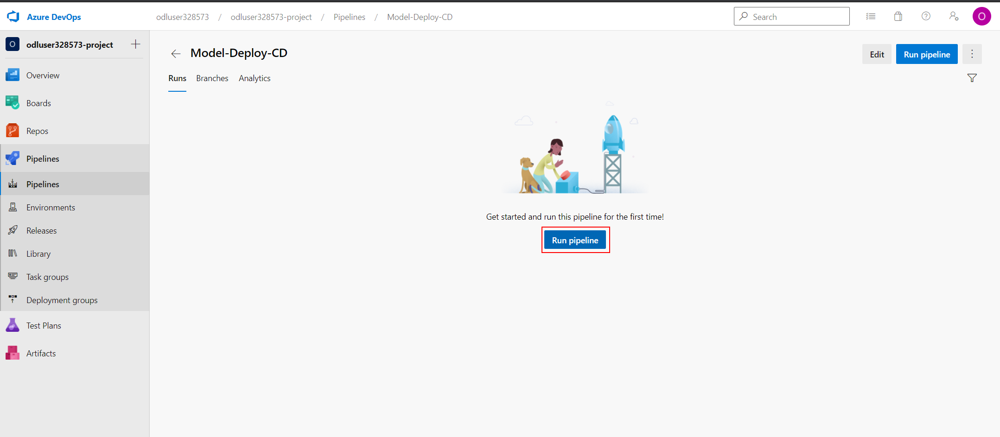

## Task 6 -  ML Ops with GitHub Actions and AML environment setup

1. Sign-in to GitHub with your GitHub account.

2. Navigate to the already genarated repository for this lab and select 
 **Settings** in order to configure the required secrets to allow GitHub Actions to access Azure.

    First you will need an [Azure service principal](https://docs.microsoft.com/en-us/azure/active-directory/develop/app-objects-and-service-principals). Just go to the Azure Portal to find the details of your resource group. Then start the Cloud CLI or install the [Azure CLI](https://docs.microsoft.com/en-us/cli/azure/install-azure-cli?view=azure-cli-latest) on your computer and execute the following command to generate the required credentials:

    ```sh
    # Replace {sp_XXXXX_githubactions} where XXXXX is the current user lab unique code, {subscription-id} and {AI-in-a-Day-XXXXX},{ai-in-a-day-XXXXX} with your 
    # Azure subscription id, resource group and ml workspace name and assign any name for your service principal for eg {sp_XXXXX_githubactions}
    
    az ad sp create-for-rbac --name http://{sp_XXXXX_githubactions} \
                            --role contributor \
                            --scopes /subscriptions/{subscription-id}/resourceGroups/{AI-in-a-Day-XXXXX}/providers/Microsoft.MachineLearningServices/workspaces/{ai-in-a-day-XXXXX} \
                            --sdk-auth
    ```

    This will generate the following JSON output:

    ```sh
    {
        "clientId": <GUID>,
        "clientSecret": <secret>,
        "subscriptionId": <GUID>,
        "tenantId": <GUID>,
        "activeDirectoryEndpointUrl": "https://login.microsoftonline.com",
        "resourceManagerEndpointUrl": "https://management.azure.com/",
        "activeDirectoryGraphResourceId": "https://graph.windows.net/",
        "sqlManagementEndpointUrl": "https://management.core.windows.net:8443/",
        "galleryEndpointUrl": "https://gallery.azure.com/",
        "managementEndpointUrl": "https://management.core.windows.net/"
    }
    ```

3. On the **Settings** tab in your repository select the Secrets section and finally add the new secret (JSON output generated at the previous step) with the name `AZURE_CREDENTIALS` to your repository.

    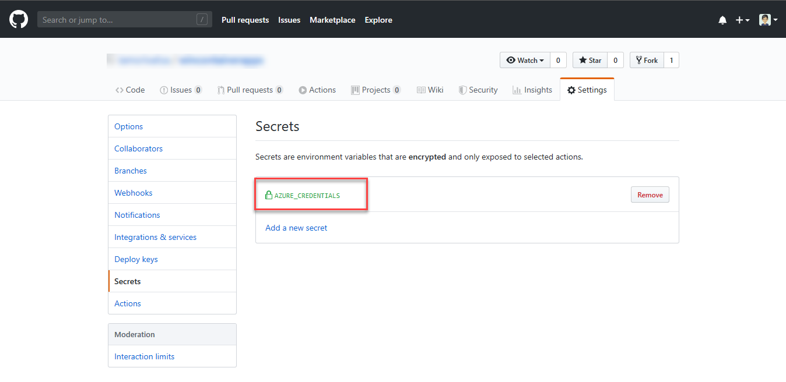  

4. To allow Azure to trigger a GitHub Workflow we also need a GitHub PAT token with `repo` access so that we can trigger a GH workflow when the training is completed on Azure Machine Learning. In GitHub, under your GitHub logged in user in the right corner, select Settings > Develper Settings > Personal access tokens. Enter a name for the new PAT and select **Generate** at the bottom of the page.

    

5. Copy the new GH PAT.

    

6. At repository level, select Settings > Secrets and add the PAT token with the name `PATTOKEN` as a new secret.
 
    

7. Open the .cloud\.azure\workspace.json file and replace the workspace name and resource group with the ones provided by the lab environment.

    

    

## Task 7 - Setup Azure Function to trigger GitHub Actions dispatch

1. Create an Azure Function App with `PowerShell Core` as the runtime stack.

    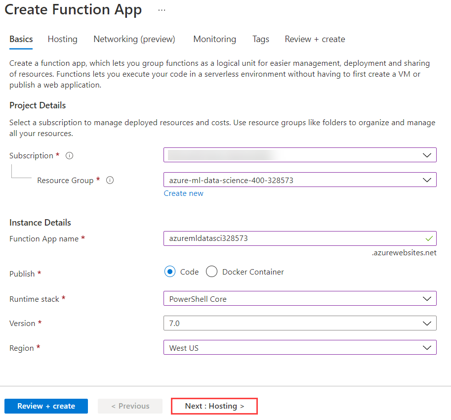

2. Use the AML workspace storage account as the storage account. Set the plan type to `Consumption (Serverless)`.

    

3. Leave all other options default and create.

4. In the `Configuration` section of the newly created Function App, add the following settings:

    - `GH_PAT` - contains the GitHub personal access token (use the one generated in Task 6)
    - `ML_DATA_STORAGE_CONNECTION_STRING` - contains the connection string of the AML workspace storage account (the one named like `mlstrgXXXXXX`)

    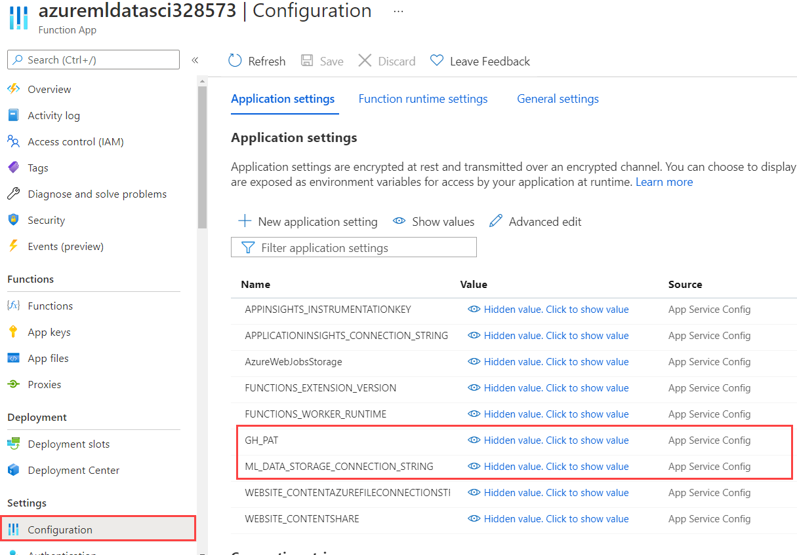


5. Create a new function, using the following settings:

    - Develop in portal
    - Template =  `Azure Blob Storage trigger`
    - Path = `azureml-blobstore-78f4ffed-e5cf-4671-9cf1-616781000344/training-data/COVID19Articles.csv` (replace `azureml-blobstore-78f4ffed-e5cf-4671-9cf1-616781000344` with the appropriate name of the blob storage container mapped as the default datastore in the AML workspace)
    - Storage account connection = `ML_DATA_STORAGE_CONNECTION`

    >NOTE
    >
    >The `COVID19Articles.csv` should already exists as a result of running one of the previous MLOps pipelines in the setup.

    

6. Replace the body of the newly create function with the following code:

    ```ps
    # Input bindings are passed in via param block.
    param([byte[]] $InputBlob, $TriggerMetadata)

    # Write out the blob name and size to the information log.
    Write-Host "PowerShell Blob trigger function Processed blob! Name: $($InputBlob.Path) Size: $($InputBlob.Length) bytes"

    $gitHubUser = "github-cloudlabsuser-1020"
    $gitHubRepo = "azure-ai-in-a-day-lab-02"
    $uri = "https://api.github.com/repos/$($gitHubUser)/$($gitHubRepo)/dispatches"
    $headers = @{ Authorization="Bearer $($env:GH_PAT)" }
    $body = "{ ""event_type"": ""storage-blobupdated"" }"

    Write-Host "Triggering GitHub action dispatch at $($uri)..."
    $result = Invoke-RestMethod  -Uri $uri -Method POST -Body $body -Headers $headers -ContentType "application/json"
    Write-Host "Successfully triggered dispatch."
    ```

    >IMPORTANT!
    >
    >In the code above, make sure you replace the value of the `$gitHubUser` variable with the actual name of the GitHub user allocated to the lab.
