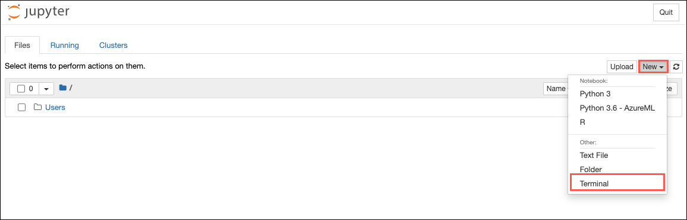
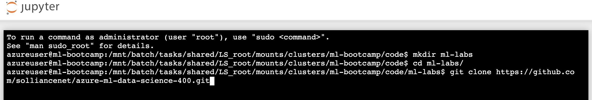

# Hands-on lab: Training and deploying a model in AML

**Contents**

<!-- TOC -->

- [Lab Overview](#lab-overview)
- [Lab Setup](#lab-setup)
   - [Task 1: Create a Compute Instance](#task-1-create-a-compute-instance)
   - [Task 2: Import the Lab Notebooks](#task-2-import-the-lab-notebooks)
- [Exercise: Training and deploying a model in AML](#exercise-training-and-deploying-a-model-in-aml)
   - [Task 1: Open Lab Notebook](#task-1-open-lab-notebook)
   - [Task 2: Execute Notebook](#task-2-execute-notebook)

## Lab Overview

In this lab, we will be using a subset of NYC Taxi & Limousine Commission - green taxi trip records available from [Azure Open Datasets](https://azure.microsoft.com/en-us/services/open-datasets/). The data is enriched with holiday and weather data. We will use data transformations and the GradientBoostingRegressor algorithm from the scikit-learn library to train a regression model to predict taxi fares in New York City based on input features such as, number of passengers, trip distance, datetime, holiday information and weather information.

The primary goal of this lab is to learn how to leverage Azure Machine Learning (AML) to provision compute resources to train machine learning models, and then deploy the trained models either to a managed Azure Container Instance (ACI) or to a containerized platform such as Azure Kubernetes Services (AKS).

## Lab Setup

### Task 1: Create a Compute Instance

In this task, you add a compute resource to your Azure Machine Learning workspace.

1. On the Machine Learning blade in the [Azure portal](https://portal.azure.com/), open Azure Machine Learning studio by selecting **Launch studio** from the center section of the screen.

   

2. In the new Azure Machine Learning studio window, select **Create new** and then select **Compute instance** from the context menu.

   

3. On the create compute instance screen, enter the following information and then select **Create**:

  - - **Compute name**: Enter `ml-bootcamp-SUFFIX`, where SUFFIX is your Microsoft alias, initials, or other value to ensure uniquely named resources.
   - **Virtual machine type**: Select `CPU`.
   - **Virtual machine size**: Select `Select from recommended options` and then select `Standard_DS3_v2`.

   

4. Wait for the Compute Instance to be ready. It takes approximately 3-5 minutes for the compute provisioning to complete.

### Task 2: Import the Lab Notebooks

In this task, you import Jupyter notebooks from GitHub that you will use to complete the exercises in this hands-on lab.

1. From within Azure Machine Learning studio navigate to **Compute, Compute instances**, and then select **Jupyter** link to open Jupyter Notebooks interface for the compute instance **ml-bootcamp-SUFFIX**.

   

2. Check **Yes, I understand** and select **Continue** in the trusted code dialog.

   

3. In the new Jupyter window, select **New** and then select **Terminal** from the context menu.

   
  
4. Run the following commands in order in the terminal window:

   - `mkdir ml-labs`
   - `cd ml-labs`
   - `git clone https://github.com/solliancenet/azure-ml-data-science-400.git`

   

5. Wait for the `clone` command to finish importing the repo.

## Exercise: Training and deploying a model in AML

### Task 1: Open Lab Notebook

1. From within Jupyter Notebooks interface navigate to `ml-labs/azure-ml-data-science-400/day-01/notebooks`.

1. Open `Lab01 - Training and deploying a model in AML`. This is the Python notebook you will step through executing in this lab.

### Task 2: Execute Notebook

1. Follow the instructions within the notebook, `Lab01 - Training and deploying a model in AML`, to complete the lab.
