# Hands-on-lab: Implementing ML pipelines with the designer

**Table of content**

* [Lab overview](#Lab-overview)
* [Exercise 1 - Design a Machine Learning pipeline with the Designer](#Exercise-1---Design-a-Machine-Learning-pipeline-with-the-Designer)
  * [Task 1 - Create the pipeline and select the default compute target](#Task-1---Create-the-pipeline-and-select-the-default-compute-target)
  * [Task 2 - Import and prepare the data](#Task-2---Import-and-prepare-the-data)
  * [Task 3 - Train a machine learning model](#Task-3---Train-a-machine-learning-model)
  * [Task 4 - Submit and evaluate the model](#Task-4---Submit-and-evaluate-the-model)
* [Exercise 2 - Publish ML pipeline with REST endpoint](#Exercise-2---Publish-ML-pipeline-with-REST-endpoint)
  * [Task 1 - Set pipeline parameters](#Task-1---Set-pipeline-parameters)
  * [Task 2 - Create a REST endpoint to publish the ML pipeline](#Task-2---Create-a-REST-endpoint-to-publish-the-ML-pipeline)
* [Exercise 3 - Test ML pipeline Rest endpoint](#Exercise-3---Test-ML-pipeline-Rest-endpoint)
  * [task1 - Submit a pipeline run from AML Studio](#task1---Submit-a-pipeline-run-from-AML-Studio)
  * [task2 - Submit a pipeline run using the REST endpoint](#task2---Submit-a-pipeline-run-using-the-REST-endpoint)

## Lab overview


Following this lab you will learn how to create a no-code machine learning pipeline using the AML Designer, and how to publish a single training Pipeline as a web service that client applications can reuse to train multiple models while changing parameters and datasets and for eventual inferencing use on new datasets. Hereunder the global schema of a published pipeline.


## Exercise 1 - Design a Machine Learning pipeline with the Designer


### Task 1 - Create the pipeline and select the default compute target


In Azure machine learning select Designer, to start with a new ML pipeline choose Easy-to-use prebuilt modules.

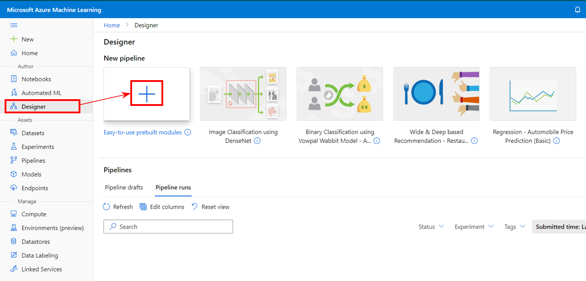


Select a compute target to run the pipeline.

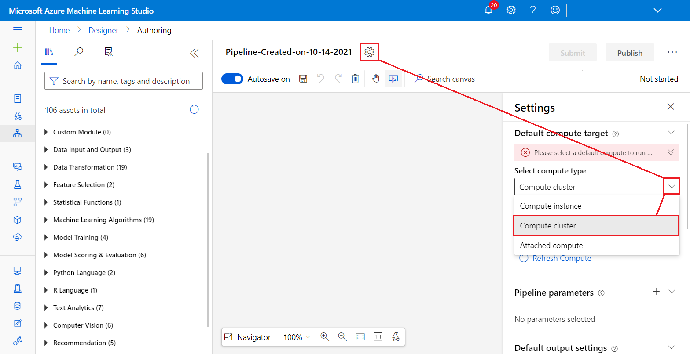


Using the prompted canvas, select a compute target if already exists, otherwise create a new one with the recommended configuration as follows.


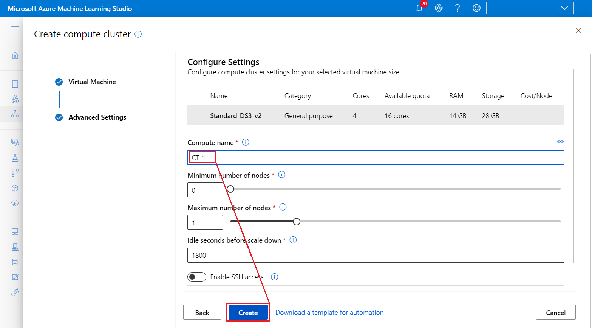


Once created you can click on save to use the new compute target. 


### Task 2 - Import and prepare the data

After creating the pipeline draft using the Designer, you’ll need some data to train the model. For this lab you will use the credit card dataset via a web URL. Using this dataset you will train a model for fraud detection based on best correlated features.
Using the web URL, you will load data from a csv file containing both training features and labels.

Start by importing and preparing the dataset for the training following the steps underneath:

* Go to the Designer's asset library
* Choose **Data Input and Output**
* Hover on **Import Data** and click on **Use module**
  >*Note : To speed up the module selection process you can enter the module's name directly to the Designer's library research box, just make sure you choose the right module.* 

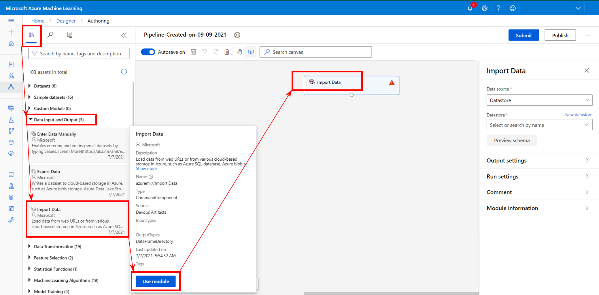

* On the module Settings menu select **Datastore** for data source
* click on **New datastore**
* On the prompt window enter `sample_datastore` for **Datastore name**
* Select **enter manually**
* Copy the following link `https://automlsamplenotebookdata.blob.core.windows.net/automl-sample-notebook-data` and past it to the **URL** box
* select `No` for **Save credentials with the datastore for data access**

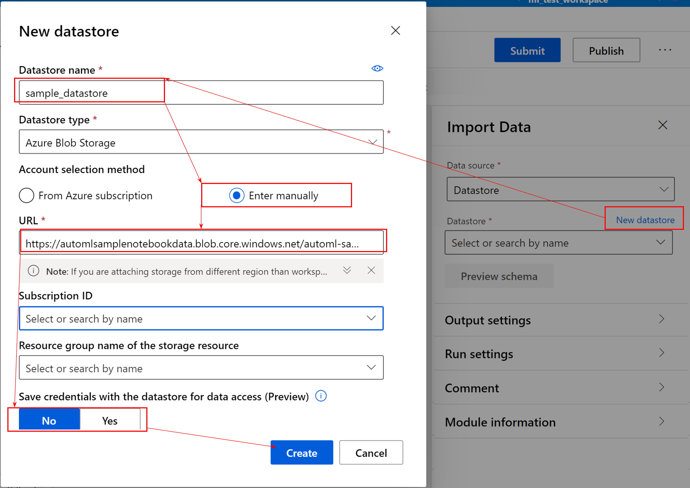

* Enter `creditcard.csv` in the Path field and make sure Validated is *checked*

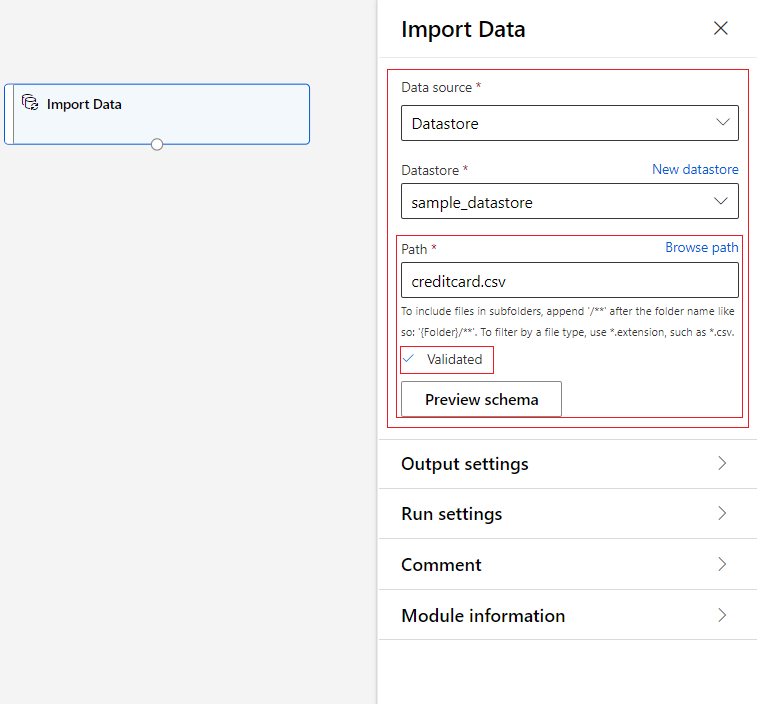

* From the Designer library choose **Data transformation** 
* Grab and drop **Clean Missing Data** module to the draft, connect the **Import Data** module to this one
* Click on **Edit column** to add columns to be cleaned. Select **all columns** using the list
* Select **Replace by mean** for **Cleaning Mode**


Next, you will split the data using randomized split, to extract the training data for the model.

* From **Data Transformation** section, scroll down to Grab and drop **Split Data** module
* Connect *Cleaned Dataset* (left output) to the **Split Data** module
* Select **Split Data** module and configure its settings as this:

  * Splitting mode: `Split Rows`
  * Fraction of rows in the first output dataset : `0.8`
  * Randomized split: `True`
  * Random seed: `42`
  * Stratified split: `False`
  
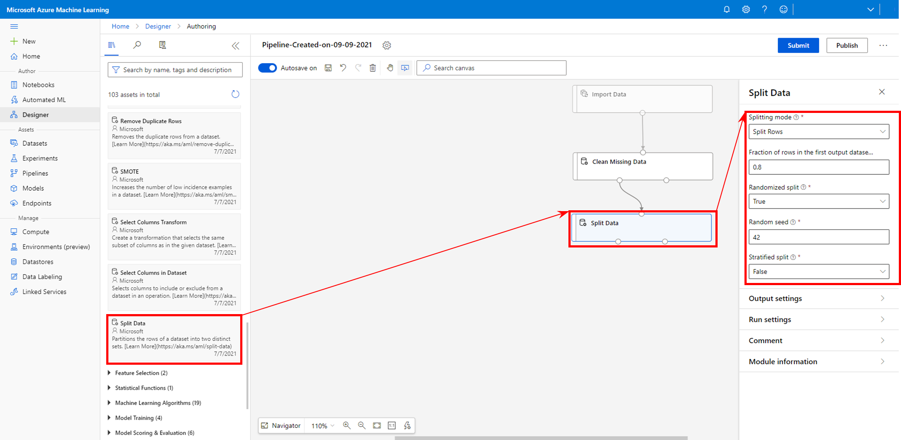

To speed up the training process and also to get more accurate results you will add a feature selection step to the pipeline, which will process a scoring method to only select best 7 features out of 30. To do so, follow these next steps:

* Under the section **Feature selection** add **Filter Based Feature Selection** to the draft
* As input give it the left output of **Split Data**
* For settings, select `True` for **Operate on feature columns only**
* Then select the **Target column** by clicking on edit column and add `Class` 
* Specify `7` as **number of desired features**, and `PearsonCorrelation` as **Feature scoring method**

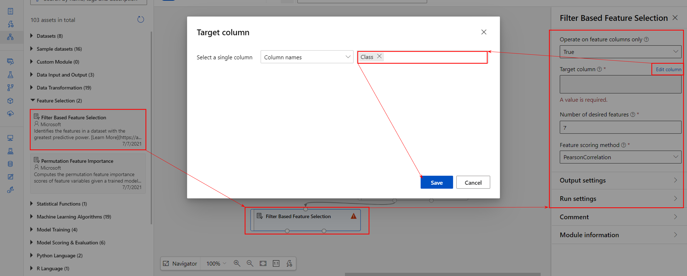

### Task 3 - Train a machine learning model

Now you are going to train a Machine learning model on the processed data. To do the fraud detection on this data, you will process a binary classification approach. For that you need a Two-Class Algorithm, let's see how to select one from the Designer's library to start training.

* Go to **Machine Learning Algorithms** section and scroll down to the *classification category*
* Grab and drop the **Two-Class Decision Forest** module and keep the default settings
* Under the **Training Model** section, grab and drop **Train Model** module
* Connect the output of the model to the left input of **Train Model** module 
* Connect the *Filtered Dataset* (left output) to the right input of **Train Model** module
* select **Train Model** module to specify the **Label Coumn** on the settings tab
* Click **Edit Column** and enter column name `Class`, click save

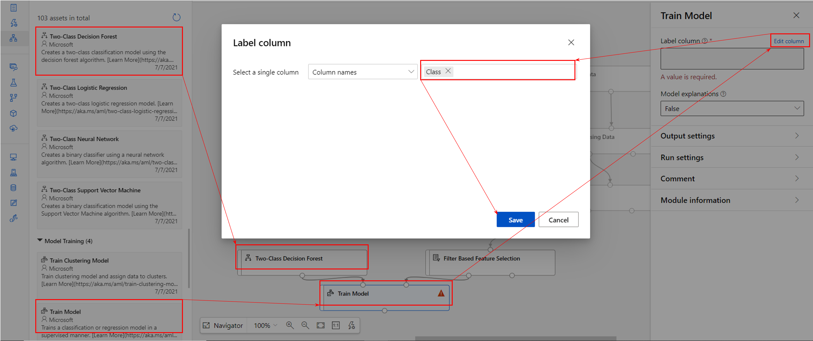

Now you need to add a scoring module to the pipeline. But first let's apply the feature selection transformation to the validation dataset.

* Expand **Data Transformation** section and drag **Select Columns Transform** to the canvas
* Connect the *Filtered Dataset* (left output) from the **Filter Based Selection** module to the new added module's input

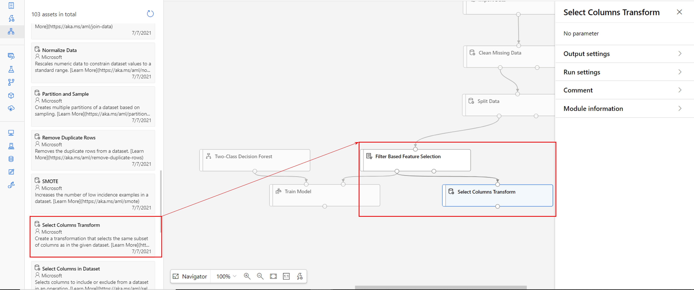

Next, you will need to add a module to apply the transformation on the validation dataset.
* Go to **Model Scoring & Evaluation** section and grab **Apply Transform** to the canvas 
* Connect the output of **Select Columns Transform** to the left input of **Apply Transform** module
* Connect the right output of **Split Data** module to the right input of **Apply Transform** module
* Now that the validation dataset is set, also from the **Model Scoring & Evaluation** section, grab and drop the **Score Model** module right under the **Train Model** module
* Connect the **Train Model** module output to the left input of  
* Connect the **Apply Transform** output to the **Score Model** right input 

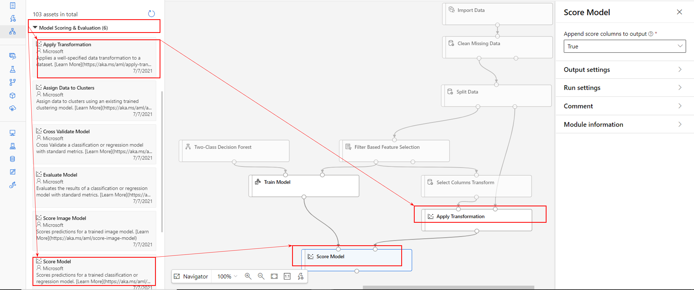

* To finish, grab and drop the **evaluate Model** module under **Score Model** and don't forget to create the connection

Here is how the whole pipeline looks like 

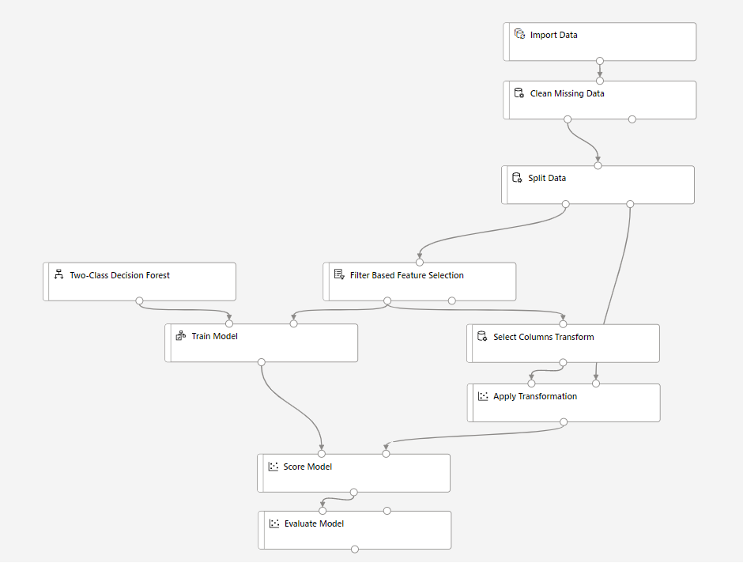

### Task 4 - Submit and evaluate the model

Now that your pipeline is setup, you can submit a pipeline run.

* At the top right, click the **Submit** button
* In the **Set up pipeline run** dialog, select **Create new** to create a new experiment
* Enter `DecisionForest_FraudDetection` as a descriptive experiment name and click **Submit**

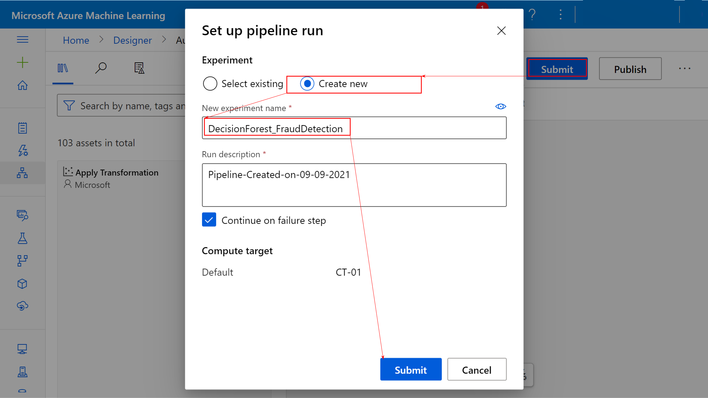

Once run is finished click on evaluate model to view results

## Exercise 2 - Publish ML pipeline with REST endpoint
After creating the pipeline draft using the AML Designer, here you are going to **Publish** the training pipeline to reuse it again in the future to train multiple models while changing parameters and datasets.

### Task 1 - Set pipeline parameters

Pipeline parameters are used to build versatile pipelines which can be resubmitted later with varying parameter values. Here in this exercise, you are going to set these parameters, as follows:

* **Data source** or the training data path, to retrain the model on different datasets
  * To add the new parameter, select **Import Data** module and under **Parameters** tab, mouseover the Path field to select the *More button*, then click on **Add to pipeline parameter** and save

  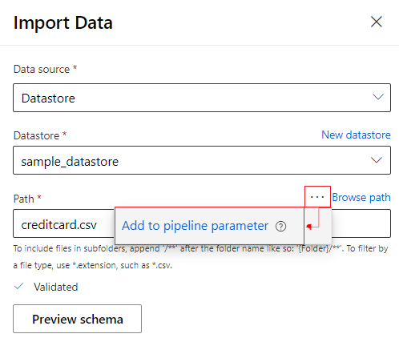

* **Fraction of rows** in the training dataset
  * To add the new parameter, select **Split Data** module and add **Fraction of rows in the first output** to pipeline parameters, then save

  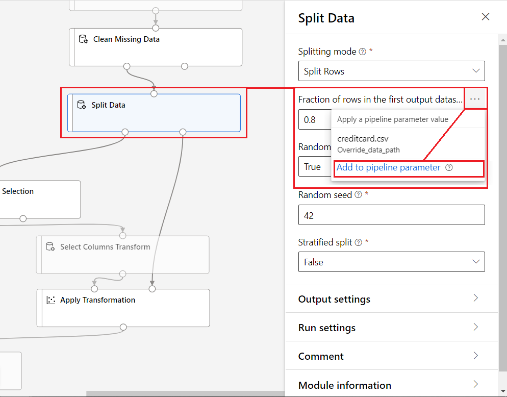

* **Number of desired features** to select for training
  * To add the new parameter, select **Filter Based Feature Selection**, add **Number of desired features** to pipeline parameters and save

  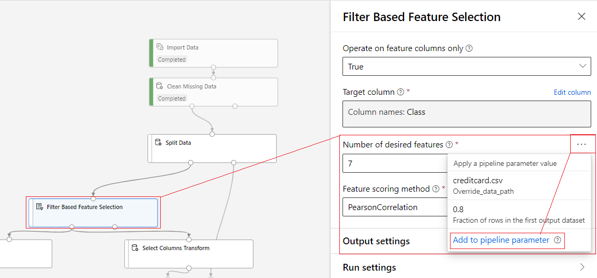

* **Number of decision trees** of the **Decision Forest** training algorithm
  * To add the new parameter, select **Two-class Decision Forest**, add **Number of decision trees** to pipeline parameters and save

  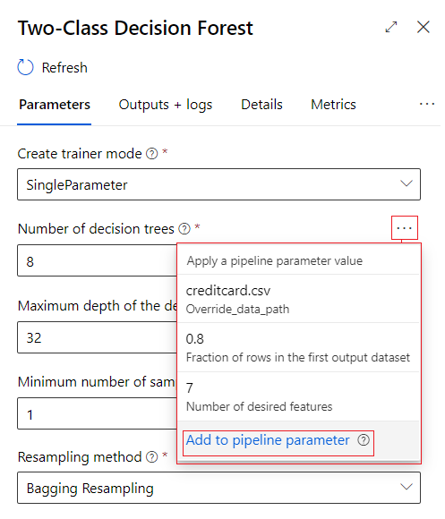

### Task 2 - Create a REST endpoint to publish the ML pipeline

After setting the pipeline parameters, now you are ready to **publish** the pipeline
* Click on the **Publish** button right on top  
* Select **Create new** to create a new **PipelineEndpoint**
* Enter `Two-class pipeline` to name the **PipelineEndpoint**
* Click Publish

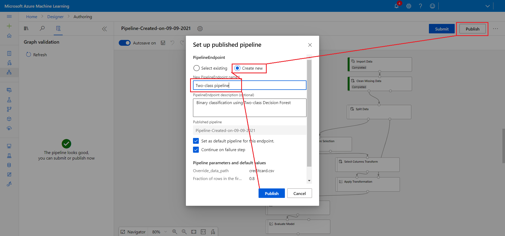

## Exercise 3 - Test ML pipeline Rest endpoint

Publishing the pipeline enables a REST endpoint to rerun the pipeline from any HTTP library on any platform. Here you are going to test the Machine Learning pipeline Endpoint that you created.

### task1 - Submit a pipeline run from AML Studio

After publish is succeeded go to the pipeline endpoint by clicking on `Two-class pipeline`

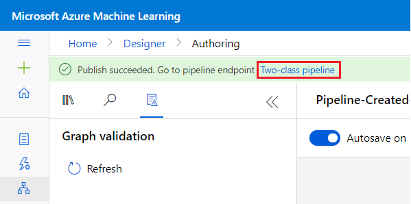

In case you can't see the notification, you can access the pipeline endpoint directly from **pipelines** under **Pipeline Endpoints** tab, by clicking on `Two-class pipeline`

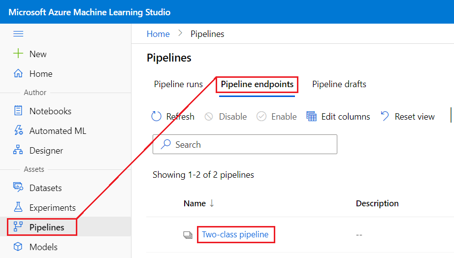

Here on the **published pipeline overview** you can find the pipeline REST endpoint properties for further use.

You can test the pipeline directly from this page, just by clicking on **Submit** to submit a new run using new parameter values that you can define in the bottom of the prompt as follows. Make sure to describe your pipeline run to keep track of different runs' specific parameters.

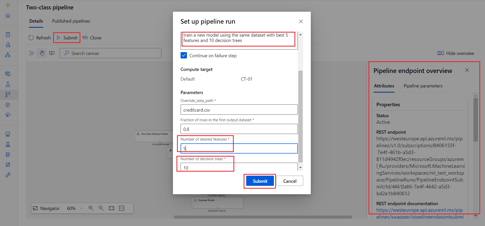

### task2 - Submit a pipeline run using the REST endpoint

To submit a new training using the pipeline REST endpoint follow these next steps:
* Get the **REST URL** from the endpoint property of the published pipeline object

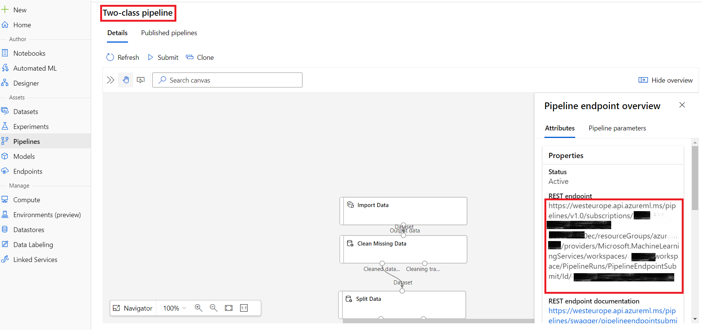

* Go to [Azure portal](https://portal.azure.com/) and open a **Bash cloud shell** 

* First you need to get your Bearer access token using this command 

```
declare token=$(echo $(az account get-access-token) | jq ".accessToken" -r)
```

* Make HTTP request using this command, make sure to replace `URL` with your pipeline **REST URL**. Notice here that you will request a submit with `8` best features and `10` decision trees

```
curl -X POST -H "Authorization: Bearer $token" -H "Content-Type:application/json" -H "Accept:application/json" URL -d '{"ParameterAssignments": {"Number of desired features":"8","Number of decision trees":"10"}}'
```

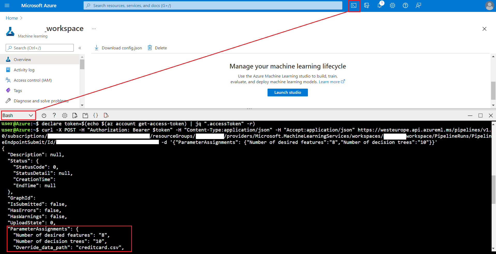

Now you can go to **Experiments** in Azure Machine Learning to access your submit.

* Select **All runs** 

* Click on the last submitted run to access the pipeline run

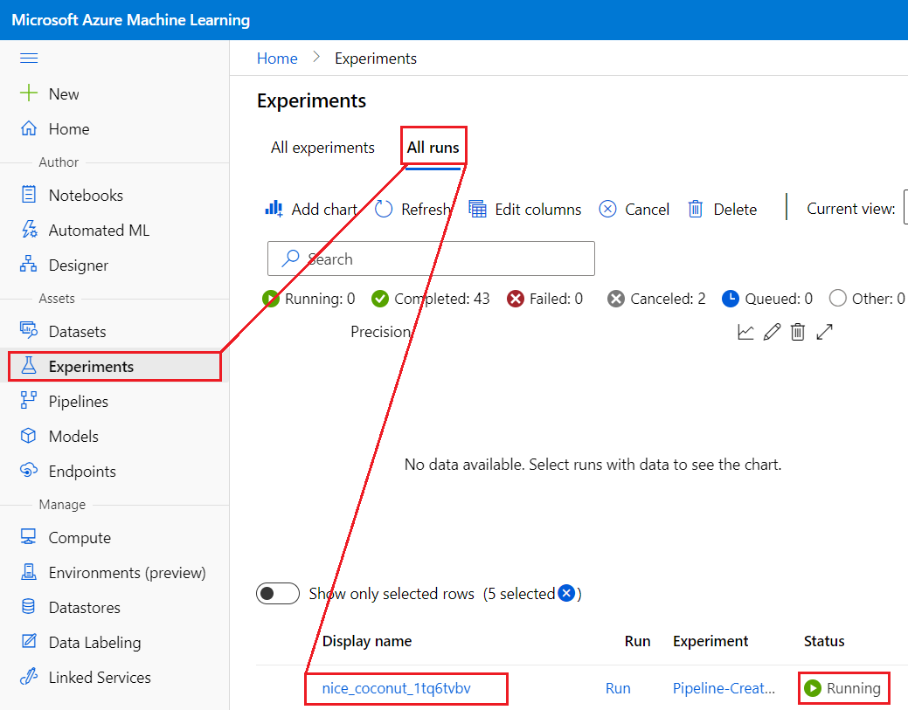

* Notice the new parameters values on the **pipeline run overview** 

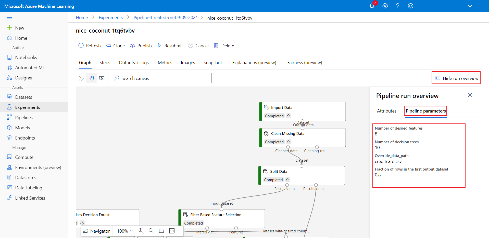

* Go to evaluate to see the new trained model's results

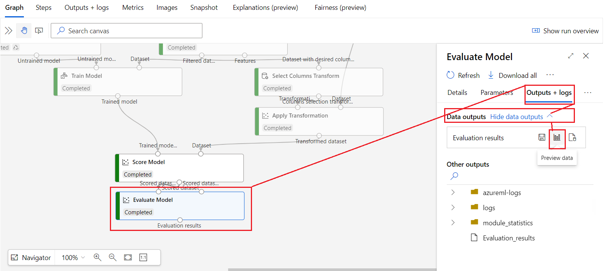
 

## Acknowledgements

This Credit Card fraud Detection dataset is made available under the Open Database License: http://opendatacommons.org/licenses/odbl/1.0/. Any rights in individual contents of the database are licensed under the Database Contents License: http://opendatacommons.org/licenses/dbcl/1.0/ and is available at: https://www.kaggle.com/mlg-ulb/creditcardfraud

The dataset has been collected and analysed during a research collaboration of Worldline and the Machine Learning Group (http://mlg.ulb.ac.be) of ULB (Université Libre de Bruxelles) on big data mining and fraud detection. More details on current and past projects on related topics are available on https://www.researchgate.net/project/Fraud-detection-5 and the page of the DefeatFraud project

Please cite the following works:

Andrea Dal Pozzolo, Olivier Caelen, Reid A. Johnson and Gianluca Bontempi. Calibrating Probability with Undersampling for Unbalanced Classification. In Symposium on Computational Intelligence and Data Mining (CIDM), IEEE, 2015

Dal Pozzolo, Andrea; Caelen, Olivier; Le Borgne, Yann-Ael; Waterschoot, Serge; Bontempi, Gianluca. Learned lessons in credit card fraud detection from a practitioner perspective, Expert systems with applications,41,10,4915-4928,2014, Pergamon

Dal Pozzolo, Andrea; Boracchi, Giacomo; Caelen, Olivier; Alippi, Cesare; Bontempi, Gianluca. Credit card fraud detection: a realistic modeling and a novel learning strategy, IEEE transactions on neural networks and learning systems,29,8,3784-3797,2018,IEEE

Dal Pozzolo, Andrea Adaptive Machine learning for credit card fraud detection ULB MLG PhD thesis (supervised by G. Bontempi)

Carcillo, Fabrizio; Dal Pozzolo, Andrea; Le Borgne, Yann-Aël; Caelen, Olivier; Mazzer, Yannis; Bontempi, Gianluca. Scarff: a scalable framework for streaming credit card fraud detection with Spark, Information fusion,41, 182-194,2018,Elsevier

Carcillo, Fabrizio; Le Borgne, Yann-Aël; Caelen, Olivier; Bontempi, Gianluca. Streaming active learning strategies for real-life credit card fraud detection: assessment and visualization, International Journal of Data Science and Analytics, 5,4,285-300,2018,Springer International Publishing

Bertrand Lebichot, Yann-Aël Le Borgne, Liyun He, Frederic Oblé, Gianluca Bontempi Deep-Learning Domain Adaptation Techniques for Credit Cards Fraud Detection, INNSBDDL 2019: Recent Advances in Big Data and Deep Learning, pp 78-88, 2019

Fabrizio Carcillo, Yann-Aël Le Borgne, Olivier Caelen, Frederic Oblé, Gianluca Bontempi Combining Unsupervised and Supervised Learning in Credit Card Fraud Detection Information Sciences, 2019Acknowledgements
