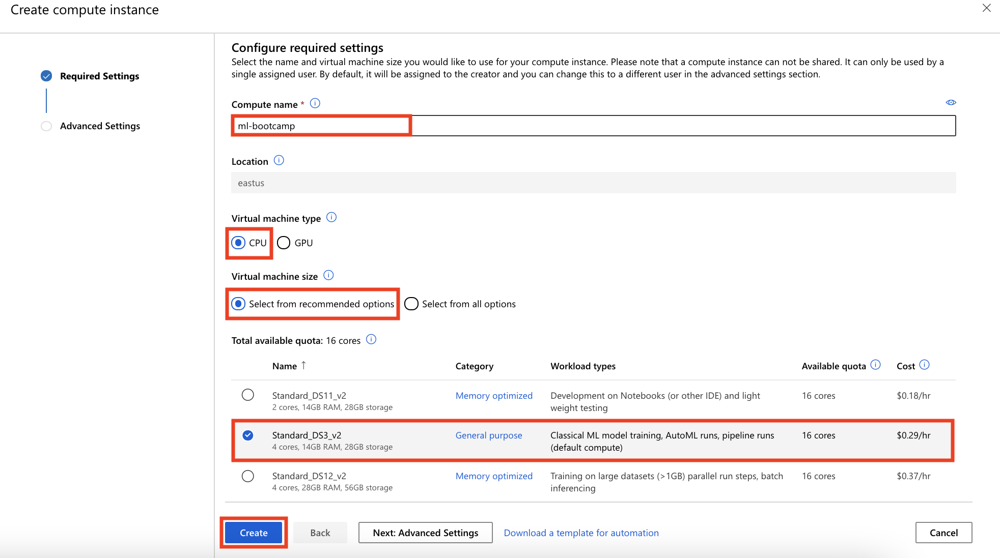
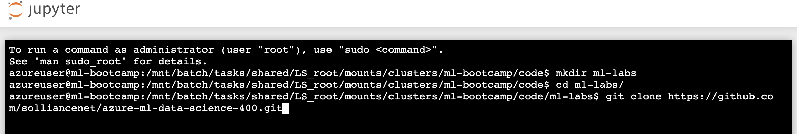

# Hands-on lab: Implementing and monitoring a Batch Scoring solution

**Contents**

<!-- TOC -->

- [Lab Overview](#lab-overview)
- [Lab Setup](#lab-setup)
   - [Task 1: Create a Compute Instance](#task-1-create-a-compute-instance)
   - [Task 2: Import the Lab Notebooks](#task-2-import-the-lab-notebooks)
- [Exercise: Implementing and monitoring a Batch Scoring solution](#exercise-implementing-and-monitoring-a-batch-scoring-solution)
   - [Task 1: Open Lab Notebook](#task-1-open-lab-notebook)
   - [Task 2: Execute Notebook](#task-2-execute-notebook)

## Lab overview

Azure Machine Learning Batch scoring targets large inference jobs that are not time-sensitive. It is optimized for high-throughput, fire-and-forget inference over large collections of data.

In this lab, we will be using [Azure Machine Learning Pipelines](https://docs.microsoft.com/en-us/azure/machine-learning/concept-ml-pipelines) to  run batch scoring task on a large data set, using a trained model. We will use the `NYC taxi fare predictor` model from Lab 01 to make batch predictions of taxi fares for customer based on a set of input features.  The AML pipeline would entail two steps:

1. **Preprocess data step**: In this step we will simulate generation of a large dataset, approximately 250k rows of data. The data generated in this step is passed as an input to the next step.
1. **Inference step**: In this step we will use a special type of step called `ParallelRunStep` to do batch scoring on the input data. The `ParallelRunStep` uses a configuration called `ParallelRunConfig` that allows you to control how to break up the scoring job in batches across the available compute nodes and their respective processors. 

Finally, we will also review how to monitor the batch scoring pipeline runs from within Azure Machine Learning Studio.

## Lab Setup

### Task 1: Create a Compute Instance

In this task, you add a compute resource to your Azure Machine Learning workspace.

1. On the Machine Learning blade in the [Azure portal](https://portal.azure.com/), open Azure Machine Learning studio by selecting **Launch studio** from the center section of the screen.

   

2. In the new Azure Machine Learning studio window, select **Create new** and then select **Compute instance** from the context menu.

   

3. On the create compute instance screen, enter the following information and then select **Create**:

  - - **Compute name**: Enter `ml-bootcamp-SUFFIX`, where SUFFIX is your Microsoft alias, initials, or other value to ensure uniquely named resources.
   - **Virtual machine type**: Select `CPU`.
   - **Virtual machine size**: Select `Select from recommended options` and then select `Standard_DS3_v2`.

   

4. Wait for the Compute Instance to be ready. It takes approximately 3-5 minutes for the compute provisioning to complete.

### Task 2: Import the Lab Notebooks

In this task, you import Jupyter notebooks from GitHub that you will use to complete the exercises in this hands-on lab.

1. From within Azure Machine Learning studio navigate to **Compute, Compute instances**, and then select **Jupyter** link to open Jupyter Notebooks interface for the compute instance **ml-bootcamp-SUFFIX**.

   

2. Check **Yes, I understand** and select **Continue** in the trusted code dialog.

   

3. In the new Jupyter window, select **New** and then select **Terminal** from the context menu.

   
  
4. Run the following commands in order in the terminal window:

   - `mkdir ml-labs`
   - `cd ml-labs`
   - `git clone https://github.com/solliancenet/azure-ml-data-science-400.git`

   

5. Wait for the `clone` command to finish importing the repo.

## Exercise: Implementing and monitoring a Batch Scoring solution

### Task 1: Open Lab Notebook

1. From within Jupyter Notebooks interface navigate to `ml-labs/azure-ml-data-science-400/day-02/notebooks`.

1. Open `Lab03 - Implementing and monitoring a batch scoring solution`. This is the Python notebook you will step through executing in this lab.

### Task 2: Execute Notebook

1. Follow the instructions within the notebook, `Lab03 - Implementing and monitoring a batch scoring solution`, to complete the lab.
