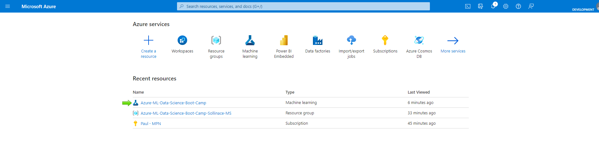
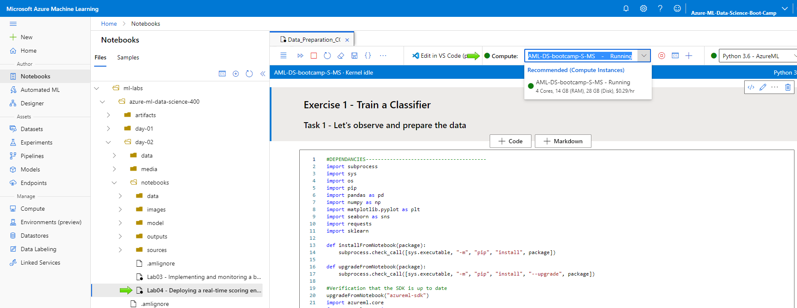

# LAB 4 - Deploying a real-time scoring endpoint with managed compute

***Note about this LAB's timing***:

This Lab has been run on a "Standard_DS3_v2 (4 cores, 14 GB RAM, 28 GB disk)" compute target, where some steps, which are are pretty long, has been timed hereunder. Do not hesitate to launch them in advance
 - LAB04_2_Train_Model.ipynb: Step 2 about training and evaluating models (~6 min.)
 - LAB04_3_Create_Docker_Container_Image_for_Scoring.ipynb: Task 2 - Deploy on managed compute and test live (~20-25 min.)

### Table of contents

* [Source dataset used by the lab](#Source-dataset-used-by-the-lab)
* [Reminder Batch scoring vs. Real-time scoring](#Quick-reminder-about-batch-scoring-(already-seen)-vs.-real-time-scoring)
* [Lab overview](#Lab-overview)
* [Lab prerequisites](#Lab-prerequisites)
* [Exercise 1 - Train a Classifier](#Exercise-1---Train-a-Classifier)
  * [Task 1 - LAB04_1_Data_Preparation.ipynb](#Task-1---LAB04_1_Data_Preparation.ipynb)
  * [Task 2 - LAB04_2_Train_Model.ipynb](#Task-2---LAB04_2_Train_Model.ipynb)
* [Exercise 2 - Deploy models on managed computed within Docker container images](#Exercise-2---Deploy-models-on-managed-computed-within-Docker-container-images)
  * [Task 1 - Test locally with Local Web service Compute target](#Task-1---Test-locally-with-Local-Web-service-Compute-target)
  * [Task 2 - Deploy on managed compute and test live](#Task-2---Deploy-on-managed-compute-and-test-live)
* [Exercise 3 - Deploy custom Docker container image with managed compute](#Exercise-3---Deploy-custom-Docker-container-image-with-managed-compute)
  * [task1 - Deploy custom Docker container image with managed compute](#task1---Deploy-custom-Docker-container-image-with-managed-compute)
  * [task2 - Pinning packages versions with requirements.txt](#task2---Pinning-packages-versions-with-requirements.txt)

## Source dataset used by the lab

### COVID-19 Case Surveillance Public Use Data

#### General considerations

https://data.cdc.gov/Case-Surveillance/COVID-19-Case-Surveillance-Public-Use-Data/vbim-akqf

The COVID-19 case surveillance system database includes individual-level data reported to U.S. states and autonomous reporting entities, including New York City and the District of Columbia (D.C.), as well as U.S. territories and states. On April 5, 2020, COVID-19 was added to the Nationally Notifiable Condition List and classified as “immediately notifiable, urgent (within 24 hours)” by a Council of State and Territorial Epidemiologists (CSTE) Interim Position Statement (Interim-20-ID-01). CSTE updated the position statement on August 5, 2020, to clarify the interpretation of antigen detection tests and serologic test results within the case classification. The statement also recommended that all states and territories enact laws to make COVID-19 reportable in their jurisdiction, and that jurisdictions conducting surveillance should submit case notifications to CDC. COVID-19 case surveillance data are collected by jurisdictions and shared voluntarily with CDC.

For more information: wwwn.cdc.gov/nndss/conditions/coronavirus-disease-2019-covid-19/case-definition/2020/08/05/.

The dataset contains 13.4 million rows of deidentified patient data (more than 3 Go). To run this lab smoothly, we will use an extract of 100.000 data points.

#### Data points description

| Variable        | Description      | Source        | Values        | Type	        | Calculation (if applicable)      |
| ------|-----|-----|-----|-----|-----|
| **cdc_report_dt**  	| Date case was first reported to the CDC 	| Calculated 	| YYYY-MM-DD 	| Date 	| Deprecated; CDC recommends researchers use cdc_case_earliest_dt in time series and other analyses. This date was populated using the date at which a case record was first submitted to the database. If missing, then the report date entered on the case report form was used. If missing, then the date at which the case first appeared in the database was used. If none are available, then left blank.  	|
| **cdc_case_earliest_dt**  	| The earlier of the Clinical Date (date related to the illness or specimen collection) or the Date Received by CDC 	| Calculated 	| YYYY-MM-DD 	| Date 	| Cdc_case_earliest_dt uses the best available date from the set of dates related to illness/specimen collection and the set of dates related to when a case is reported. It is an option to end-users who need a date variable with optimized completeness. The logic of cdc_case_earliest_dt is to use the non-null date of one variable when the other is null and to use the earliest valid date when both dates are available.  If no date available, then left blank. 	|
| **pos_spec_dt**  	| Date of first positive specimen collection 	| Case Report Form 	| YYYY-MM-DD 	| Date 	|  	|
| **onset_dt**  	| Date of symptom onset 	| Case Report Form 	| YYYY-MM-DD 	| Date 	|  	|
| **current_status**  	| What is the current status of this person? 	| Case Report Form 	| Laboratory-confirmed case Probable case 	| String 	| Please see latest CSTE case definition for more information. 	|
| **sex**  	| Gender 	| Case Report Form 	| [Male - Female - Unknown - Other - Missing - NA] 	| String 	|  	|
| **age_group**  	| Age group categories 	| Calculated 	| [0 - 9 Years - 10 - 19 Years - 20 - 39 Years - 40 - 49 Years - 50 - 59 Years - 60 - 69 Years - 70 - 79 Years - 80 + Years - Missing - NA] 	| String 	| The age group categorizations were populated using the age value that was reported on the case report form. Date of birth was used to fill in missing/unknown age values using the difference in time between date of birth and onset date. 	|
| **race_ethnicity_combined**  	| Race and Ethnicity (combined) 	| Calculated 	| [American Indian/Alaska Native, Non-Hispanic - Asian, Non-Hispanic - Black, Non-Hispanic - Multiple/Other, Non-Hispanic - Native Hawaiian/Other Pacific Islander, Non-Hispanic - White, Non-Hispanic - Hispanic/Latino - Unknown - Missing - NA] 	| String 	| If more than race was reported, race was categorized into multiple/other races. 	|
| **hosp_yn**  	| Was the patient hospitalized? 	| Case Report Form 	| [Yes - No - Unknown - Missing] 	| Character 	|  	|
| **icu_yn**  	| Was the patient admitted to an intensive care unit (ICU)? 	| Case Report Form 	| [Yes - No - Unknown - Missing] 	| Character 	|  	|
| **death_yn**  	| Did the patient die as a result of this illness? 	| Case Report Form 	| [Yes - No - Unknown - Missing] 	| Character 	|  	|
| **medcond_yn**  	| Pre-existing medical conditions? 	| Case Report Form 	| [Yes - No - Unknown - Missing] 	| Character 	|  	|

## Quick reminder about batch scoring (already seen) vs. real-time scoring

Once your models are trained, there are two main ways you can deploy them in order to score some new data: Batch and real-time deployment.
Scoring data means for instance: assign new data to a class, estimate or forecast some values based on new data.

. Batch scoring means that you will collect a batch of data across a periodic time schedule you defined, and then, on a regular basis, score all the data collected in the batch, and deliver the results of this scoring.

. On the other hand, real-time scoring means that you will score new data when they come in.

Both of those methods have pros and cons. After LAB03 and LAB04, you will be able to identify when to choose batch scoring vs. real-time scoring.

More specifically in this lab, you will learn what is a real-time scoring solution, when and how to use it. 

For the Batch scoring solution, you need to build ML pipelines you have seen on LAB02.

The batch inferencing, or batch scoring method, is the most usual in the real-life usages.
So why choosing batch over real-time:

 . The costs: On the cloud, you pay depending on your usage of ressources. In the batch scoring scenario, you switch on the compte target used to score the data only when you need it. So you avoid the cost of a 24/7 up and running machine.

. Genericity: Using the pipelines patterns, batch scoring is more generic and so more re-usable/replicable than a real-time solution.

. Simplicity: While Batch inferencing simply deals with data loaded on your Azure datastore, and then send the results to another storage, real-time endpoints can be accessed by any type of program or application, that's why you often have to bring some more customizations into them.

For the real-time scoring solution, you will build scoring endpoints hosted on the Compute Target of your choice.

Real-time inferencing is usualy more expensive and more complex to operate. But they are a must have for many real life use cases, for instance:

. Online products recommendations

. Online moderation

. Fraud detection

. Predictive maintenance of industrial assets

## Lab overview

In this lab you will use the COVID-19 Case Surveillance Public Use Data to make some two-class classifications, to see if the model estimates
if yes or not the patient will survive. Then, not in the lab but if you wish, you will use the probability of this estimation to get an intuition of the level of risk of an infected patient.

. Preparing a model: You will use your current [Azure Machine Learning compute instance](https://docs.microsoft.com/en-us/azure/machine-learning/how-to-create-manage-compute-instance?tabs=python)
You will do some data exploration and preparation.
You will use some supervised machine learning algorithms to produce a scoring model.

. Deploying the endpoint for development and tests purposes using your local compute instance.
Then you will deploy your real-time scoring model, evaluate the model itself, score some data with it, and validate it works (basic testings)

. Deploying the endpoint for real-life usage using the compute instance of your choice.

All the compute resources you will use are fully managed and maintained by the Azure platform, you just have to cherry-pick the appropriate one depending on your performance needs vs. costs.

In the following exercises, you will train a Machine Learning model, create a Docker container image to score (i.e. evaluate) your model then deploy this container image with a managed compute resource, test your scoring endpoint to start using your model for real, then monitor it to constantly check it's still running accurately and see if there is a need to retrain it.

*The functional purpose of this lab*: During the COVID-19 pandemic, a key question has been to understand which patients were the most at risk, for instance to give some priority to vaccination access or to more or less close symptoms monitoring. In this lab, depending on some parameters that are easy to access, you would be able to evaluate the risk for a patient as soon as he presents himself in a laboratory.

## Lab prerequisites

A Workspace on Azure Machine Learning, and a Compute target up and running, but you should have at least one from former labs.

## Exercise 1 - Train a Classifier

### Task 1 - LAB04_1_Data_Preparation.ipynb

First, you want to explore the data to understand them and maybe prepare them so that a machine can have optimal exploitation of your data in the context of the defined purpose.

Go to your Microsoft Azure subscription home page, and click on your Machine Learning resource.

Then click on "Launch studio".

Once on the studio home page, click on Notebooks.

Open the notebook "LAB04_1_Data_Preparation_COVID-19-Case-Surveillance-Public-Use-Data.ipynb" in the folder "LAB04".

You can observe that you are asked to choose (and start if not started) a compute. We will choose for data preparation and model training an [Azure Machine Learning compute instance](https://docs.microsoft.com/en-us/azure/machine-learning/how-to-create-manage-compute-instance?tabs=python) as it is simple, low cost and big enough for the curent purpose.

*Note*: If you do not have a compute target defined, please advise your instructor.

Open the data preparation Notebook "LAB04_1_Data_Preparation_COVID-19-Case-Surveillance-Public-Use-Data.ipynb".

Now execute the file cell by cell.

### Task 2 - LAB04_2_Train_Model.ipynb

Open the notebook "Train_Model.ipynb" and execute cell by cell.

From a more functional point of view, in these pandemic conditions, you will have to balance between:
- On the one hand be careful to not miss to put under surveillance a patient at risk, even though this means you will monitor a bit more people than necessary, because someone's life is involved.
 This part of the "equation" is favored by the Recall (how many - which proportion - of pertinent elements has been selected)
- But on another hand, be careful to avoid to over-monitor, to not provoke a saturation of your medical services, because in that case too, you put some people's lives at risk.
This part of the "equation" is favored by the Precision (how many - which proportion - of selected elements are pertinent)

To compare models, we will:

. Observe if our data are balanced, and they are (60/40)

. Remind that we want to be balanced between precision and recall

So we will use the F1-score (weighted average between our two relatively balanced classes) to choose our "best" model, and the F1 given by the sklearn metrics we used in the Notebook takes by default a good balance between precision and recall.
And as this metric is the same for some of the models, and as the F1-score is applicable on any point of the ROC curve, then we will look at the AUC (area under the ROC curve) and take the biggest AUC, sort of generalization of the F1 for all precision/recall threshold values.
And as even in that case there are still some equal models, we will choose, among the best scoring models, the one which is the easiest to maintain and/or update, or the easiest to debug, or the easiest to train, depending on your purposes. In our case the "Decision Tree" (more simple model than Random Forest but with the same score. On the long run, with more data or more variable in the future, the Random Forest could manage more complex models so could have been a better choice, anyway, not exactly the point of this lab)

Then we will plot for this model the ROC curve. Moving along the ROC curve plotted you can also decide acceptable thresholds between Precision and Recall. The recall will let you know how many patients you accept to put at risk by missing their vulnerability to the virus, and will also let you calculate for which recall threshold you will reach saturation of your intensive care services.

Once registered, you can view your model in the interface. Note that in the "Models" section of the interface, you will be able to see your models and to observe that they are versioned automatically at each new registering, so that you can deploy any version.

In the further exercises, we will use Notebooks to deploy your model and use it as a real-time endpoint. Just for illustration purposes, you may want to know that this deployment can be done from the Azure ML interface.

## Exercise 2 - Deploy models on managed computed within Docker container images

Now you have your model, having it into production, especially in the proper environment is key. You need some dependencies, Python packages, and so on.

In this exercise you will use MS Prebuilt images environments and add some dependencies (using CondaDependencies()), to customize a bit and ensure some stable reproducible environments. This could already cover most of your needs.

In this exercise you will use the Notebook "LAB04_3_Create_Docker_Container_Image_for_Scoring.ipynb".

### Task 1 - Test locally with Local Web service Compute target

While your development is in progress, you may want to deploy often and quickly for continuous testing purposes to validate your models before live / production deployment.

You can in that case choose the [Local Web service Compute target](https://docs.microsoft.com/en-us/azure/machine-learning/how-to-deploy-local-container-notebook-vm), i.e. your current Compute Instance.

After registering your model, you will need a scoring script for testings purposes.

The code provided in your Notebook should create automatically this scoring script, but in case you want to create it by yourself, you can do it directly from the interface.

Also, at some point, you will have to launch the command line interface (CLI) to test your script is working.

### Task 2 - Deploy on managed compute and test live

Almost the same thing, just that you will change the deployment_config for production. It is also in the deployment config that you will choose your compute target.

Now you are fine with your model, you want to deploy it on production so that the client can start using it.

The recommended Compute targets for this are [Azure Kubernetes Service (AKS)](https://docs.microsoft.com/en-us/azure/machine-learning/how-to-deploy-azure-kubernetes-service?tabs=python) (AKS) for high-scale production deployments, or [Azure Container Instances](https://docs.microsoft.com/en-us/azure/machine-learning/how-to-deploy-azure-container-instance) (ACI) for low-scale scenarios.

We will choose AKS. When the deployment is done with the Python Notebook, you can observe your endpoint and its settings.

You can also observe the created compute.

And if you go to your Azure portal home page you could observe that the appropriate Kubernetes service resource has been created for you.

Now you can then consume your remote Web Service from Python, C#, R, CLI (examples are given directly in the details page of your endpoint).

But before if you prefer you can also test it from the interface.

As there is a cost of having an up and running service, you can stop it when needed. To do so just go to your Azure portal and edit your "Kubernetes service" resource. You can also access it from the details page of your Inference cluster when clicking on the "Cluster name".

*Note* that **if you already have an AKS cluster in your Azure subscription**, you can [attach it to your workspace](https://docs.microsoft.com/en-us/azure/machine-learning/how-to-create-attach-kubernetes?tabs=python#attach-an-existing-aks-cluster) to use it.

## Exercise 3 - Deploy custom Docker container image with managed compute

Moving forward on the Notebook "LAB04_3_Create_Docker_Container_Image_for_Scoring.ipynb".

### Task 1 - Deploy custom Docker container image with managed compute

In this exercise, the principle is the same as before but now you will build your own Docker custom images using dockerfile (vs. requirements.txt or dependencies.yml or CondaDependencies()) within your Azure ML custom environment.

Then you will deploy locally as it goes faster to test your custom environment works fine with your Web Service.

*Note* that you now can use the custom container you have just created within the context of your workspace and environment. But if you want to store and manage your custom Docker containers - for instance using push and pull Docker commands to store them then get them back, you will have to use a new resource: the [Azure container registry](https://docs.microsoft.com/en-us/azure/container-registry/container-registry-get-started-portal).

### Task 2 - Pinning packages versions with requirements.txt

Finally, as it is useful, especially when you work as a team, to pin your packages versions so that your manipulations are reproducible and sharable with a team, you can run the last deployment using requirements.txt while defining your environment.

You can observe on the environments page of the interface, if you go to the "Custom environments" tab, that the custom environment you made during this lab is versioned, and all the versions can be built separately, directly from the interface.

Before the build:

After the build:

