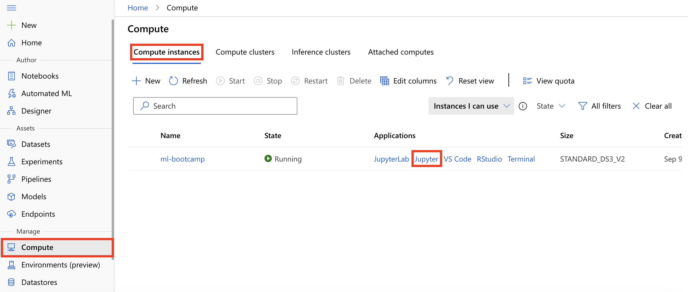

# Lab 05 - Data preparation and monitoring

- [Lab 05 - Data preparation and monitoring](#lab-05---data-preparation-and-monitoring)
  - [Lab overview](#lab-overview)
  - [Exercise 1: Protect privacy with the SmartNoise SDK](#exercise-1-protect-privacy-with-the-smartnoise-sdk)
    - [Task 1: Identify location of lab notebooks](#task-1-identify-location-of-lab-notebooks)
    - [Task 2: Understand a simple reconstruction attack](#task-2-understand-a-simple-reconstruction-attack)
    - [Task 3: Protect against reidentification attacks](#task-3-protect-against-reidentification-attacks)
    - [Task 4: Analyze the impact of Differential Privacy on data](#task-4-analyze-the-impact-of-differential-privacy-on-data)
  - [Exercise 2: Data drift detection](#exercise-2-data-drift-detection)
    - [Task 1: Analyse data drift in an Azure Machine Learning dataset](#task-1-analyse-data-drift-in-an-azure-machine-learning-dataset)

## Lab overview

In this lab you will perform three core Azure Machine Learning data workloads:

- Protect privacy with the SmartNoise SDK
- Monitoring model performance with data drift

## Exercise 1: Protect privacy with the SmartNoise SDK

Sensitive and confidential information about individuals is extensively used and shared between companies, government entities, research organizations, and other parties. Inadequate usage of this kind of information can result in significant consequences, such as harm to an individual's reputation, employability, creditworthiness, and insurability.

Pioneered by Microsoft Research and their collaborators, Differential Privacy is the gold standard for protecting individuals' data in applications like preparing and publishing statistical analyses. Differential Privacy provides a mathematically measurable privacy guarantee to individual data subjects. It offers significantly higher privacy levels than commonly used disclosure limitation practices like data anonymization. The latter increasingly shows vulnerability to re-identification attacks – especially as more data about individuals become publicly available.

>**NOTE**
> The content of this lab allows you to follow on the process of applying differential privacy without having in-depth knowlege about its inner workings. To learn more about Differential Privacy and the SmartNoise SDK, see these resources:
> - The [SmartNoise SDK GitHub repository](https://github.com/opendp/smartnoise-sdk).
> - The [Microsoft SmartNoise Differential Privacy Machine Learning Case Studies](https://azure.microsoft.com/en-us/resources/microsoft-smartnoisedifferential-privacy-machine-learning-case-studies/) whitepaper from Microsoft.
> - The [Differential Privacy for Everyone](https://download.microsoft.com/download/D/1/F/D1F0DFF5-8BA9-4BDF-8924-7816932F6825/Differential_Privacy_for_Everyone.pdf) whitepaper from Microsoft.

### Task 1: Identify location of lab notebooks

1. On the Machine Learning blade in the [Azure portal](https://portal.azure.com/), open Azure Machine Learning studio by selecting **Launch studio** from the center section of the screen.

   

2. From within Azure Machine Learning studio navigate to **Compute, Compute instances**, select the compute instance **ml-bootcamp-SUFFIX** and make sure it is running otherwise click start, then select **Jupyter** link to open Jupyter Notebooks interface.

   

3. Check **Yes, I understand** and select **Continue** in the trusted code dialog.

   

4. From within Jupyter Notebooks interface navigate to ``users/odl_user_xxxxxx/day-03/notebooks``.

### Task 2: Understand a simple reconstruction attack

1. Open `Lab05 - Simple reconstruction attack`. This is the Python notebook you will step through executing in this task.

2. Follow the instructions within the notebook, `Lab05 - Simple reconstruction attack`, to complete the task.

### Task 3: Protect against reidentification attacks

1. Open `Lab05 - Reidentification attack`. This is the Python notebook you will step through executing in this task.

2. Follow the instructions within the notebook, `Lab05 - Reidentification attack`, to complete the task.

### Task 4: Analyze the impact of Differential Privacy on data

1. Open `Lab05 - Data analysis`. This is the Python notebook you will step through executing in this task.

2. Follow the instructions within the notebook, `Lab05 - Data analysis`, to complete the task.

## Exercise 2: Data drift detection

### Task 1: Analyse data drift in an Azure Machine Learning dataset

1. Open `Lab05 - Data drift monitoring`. This is the Python notebook you will step through executing in this task.

2. Follow the instructions within the notebook, `Lab05 - Data drift monitoring`, to complete the task.
