# Lab 06 - Using AML from Synapse Analytics Studio

- [Lab 06 - Using AML from Synapse Analytics Studio](#lab-06---using-aml-from-synapse-analytics-studio)
  - [Lab overview](#lab-overview)
  - [Exercise 1: Establish a linked service connection to the Azure Machine Learning workspace](#exercise-1-establish-a-linked-service-connection-to-the-azure-machine-learning-workspace)
    - [Task 1: Grant Contributor rights to the Azure Machine Learning Workspace to the Synapse Workspace Managed Identity](#task-1-grant-contributor-rights-to-the-azure-machine-learning-workspace-to-the-synapse-workspace-managed-identity)
    - [Task 2: Create a linked service in Azure Synapse Analytics to connect with the Azure Machine Learning workspace](#task-2-create-a-linked-service-in-azure-synapse-analytics-to-connect-with-the-azure-machine-learning-workspace)
  - [Exercise 2: Ingest data](#exercise-2-ingest-data)
    - [Task 1: Grant Storage Blob Contributor to the user account](#task-1-grant-storage-blob-contributor-to-the-user-account)
    - [Task 2: Ingest dataset into a Spark table](#task-2-ingest-dataset-into-a-spark-table)
  - [Exercise 3: Train a regression model](#exercise-3-train-a-regression-model)
    - [Task 1: Create new AutoML experiment using the AML Integration with Azure Synapse Analytics](#task-1-create-new-automl-experiment-using-the-aml-integration-with-azure-synapse-analytics)
    - [Task 2: View details of the experiment run in AML Studio](#task-2-view-details-of-the-experiment-run-in-aml-studio)
  - [Exercise 4: Consume the trained regression model](#exercise-4-consume-the-trained-regression-model)
    - [Task 1: Load prospective compute module data](#task-1-load-prospective-compute-module-data)
    - [Task 2: Enrich research and development SQL table with the trained model](#task-2-enrich-research-and-development-sql-table-with-the-trained-model)
  - [Conclusion](#conclusion)

## Lab overview

Azure Synapse Analytics is an enterprise-grade analytics service and a one-stop-shop for all your analytical processing needs. Azure Synapse Analytics combines enterprise data warehousing, industry-leading SQL (both serverless and dedicated), Spark technologies, ETL/ELT pipelines, and deep integrations with other Azure services such as Power BI, Cosmos DB, and Azure ML. All of these integrations and capabilities are made available via a single user interface, Synapse Studio. The focus of this lab is to explore the integration of Azure Machine Learning with Azure Synapse Analytics.

Contoso Hardware is in the business of building high-performing hardware modules for smart factory equipment. Contoso has partnered with many vendors to obtain critical compute components that provide processing power for initial signal acquisition and processing of vibration-related data, namely displacement (Peak to Peak), Velocity (Peak), Acceleration (True Peak), and High-Frequency Accelerations (RMS). This data is ultimately used for predictive maintenance functions, performing specific actions, and initiating alerts should failure conditions arise. Therefore, it is vital that Contoso Hardware's product yield the best performance possible for its form factor.

Contoso Hardware Research and Development has been tasked with training a machine learning model that can quickly assess the estimated relative performance of a vendor compute module. Identifying the features that lead to a more performing compute module can assist in the design of new hardware and also the quick elimination of candidate hardware proposed by external vendors. Contoso Hardware has provided the following dataset structure to assist with this effort.

| Field | Type | Description |
|-------|------|-------------|
| VendorName | string | |
| ModelName | string | |
| MYCT | int | machine cycle time in nanoseconds |
| MMIN | int | minimum main memory in kilobytes |
| MMAX | int | maximum main memory in kilobytes |
| CACH | int | cache memory in kilobytes |
| CHMIN | int | minimum channels in units |
| CHMAX | int | maximum channels in units |
| PRP | int | published relative performance |
| ERP | int | estimated relative performance |

## Exercise 1: Establish a linked service connection to the Azure Machine Learning workspace

The integration of Azure Machine Learning workspace with Azure Synapse Analytics is made possible through a linked service. A linked service is essentially a connection string from Azure Synapse Analytics to external resources. This exercise demonstrates establishing security for the integration as well as the creation of the linked service.

### Task 1: Grant Contributor rights to the Azure Machine Learning Workspace to the Synapse Workspace Managed Identity

Azure Synapse Analytics supports the concept of a Managed Identity. This identity is automatically created when the Synapse Workspace is deployed and represents the Azure Synapse Analytics workspace when interacting with other Azure Resources. Data pipelines defined within Azure Synapse Analytics will run under the context of this identity; therefore, it must be granted appropriate permissions to all the integrations contained within the pipeline. These permission requirements are equally valid for the Azure Machine Learning integration.

In this task, the Synapse Workspace Managed Identity will be granted **Contributor** rights to the Azure Machine Learning workspace.

1. In the Azure Portal, open the lab resource group, then select the **Machine Learning** resource named **amlworkspace{SUFFIX}**.

2. From the left menu, select **Access Control (IAM)**

3. Expand the **Add** button and choose **Add role assignment**.

    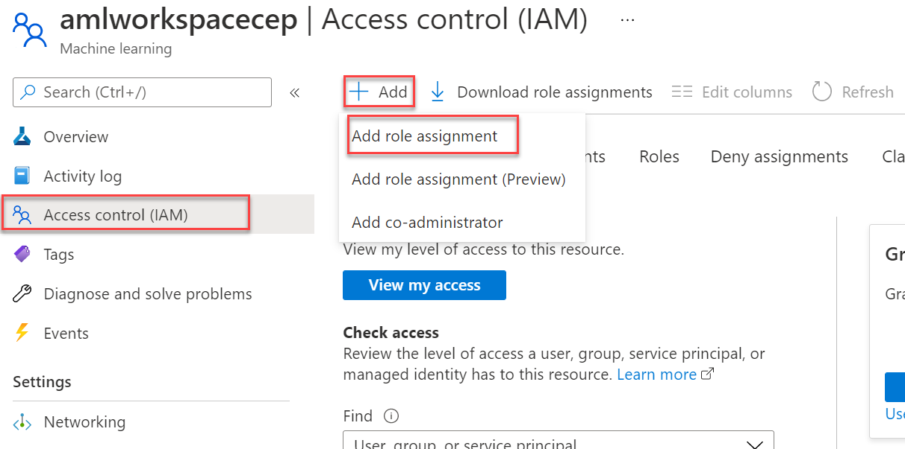

4. In the **Add role assignment** blade, populate the form as follows, then select **Save**:

    | Field | Value |
    |-------|-------|
    | Role | Select **Contributor** |
    | Assign access to | Select **User, group, or service principal** |
    | Select | Enter the name of the Synapse Workspace **synapseworkspace{SUFFIX}**, then select it from the search results |

    

### Task 2: Create a linked service in Azure Synapse Analytics to connect with the Azure Machine Learning workspace

The Azure Synapse Analytics managed identity now has Contributor access to the Azure Machine Learning Workspace. To complete the integration between these products, we will establish a linked service between both resources.

1. In the Azure portal, open the lab resource group and select the **Synapse Workspace** resource named **synapseworkspace{SUFFIX}**.

2. Under the **Getting started** section, select the **Open** link on the card titled **Open Synapse Studio**.

    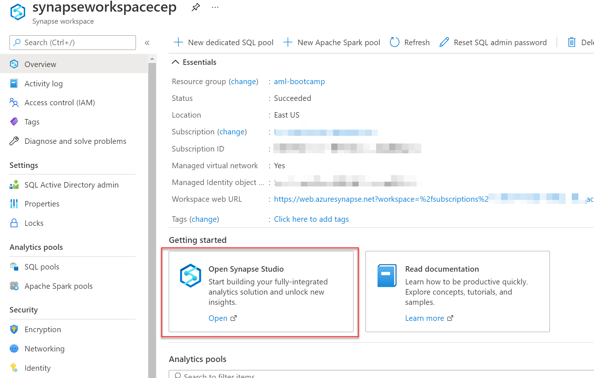

3. From the left menu, select the **Manage** hub.

4. From the Manage Hub menu, select **Linked Services**.

5. Select **New** from the Linked Services toolbar menu.

    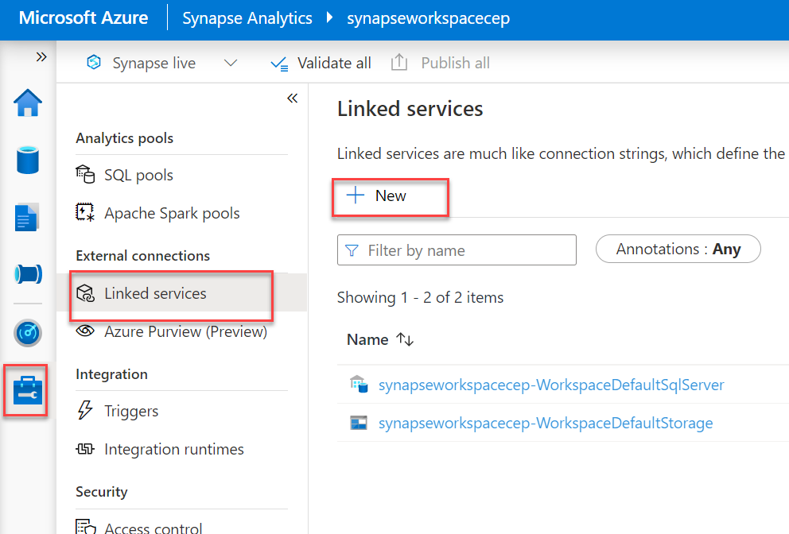

6. In the New linked service blade, search for and select **Azure Machine Learning**.

   

7. In the New linked service (Azure Machine Learning) blade, populate the form as follows, then select **Create**:
  
    | Field | Value |
    |-------|-------|
    | Name | amlworkspace |
    | Azure Machine Learning workspace selection method | From Azure subscription |
    | Azure Subscription | Select the lab subscription. |
    | Azure Machine Learning workspace name | Select the **amlworkspace{SUFFIX} resource. |

    

8. From the Synapse workspace toolbar, select **Publish all** to save the linked service, then select **Publish** on the pending changes blade.

    

## Exercise 2: Ingest data

Contoso Hardware Research and Development has been provided a sample dataset in CSV format to use when training the machine learning model. First, this data needs to be ingested. This exercise uses the Apache Spark pool in Azure Synapse Analytics to ingest the dataset and persist the data as a Spark table. From a physical perspective, when a Spark table is persisted, the data is stored in parquet format in the Synapse Workspace storage account.

### Task 1: Grant Storage Blob Contributor to the user account

When executing a Synapse Notebook it will run under the context of the user executing the notebook. Therefore, the current user needs to have sufficient access to the storage account to write the Spark table parquet files.

1. In the Azure Portal, open the lab resource group, and select the **datalake{SUFFIX}** storage account.

2. From the left menu, select **Access control (IAM)**.

3. Expand the **+ Add** button and select **Add role assignment**.

4. In the **Add role assignment** blade, select **Storage Blob Data Contributor**.

5. In the **Select**, search for and select your user account, then select **Save**.

    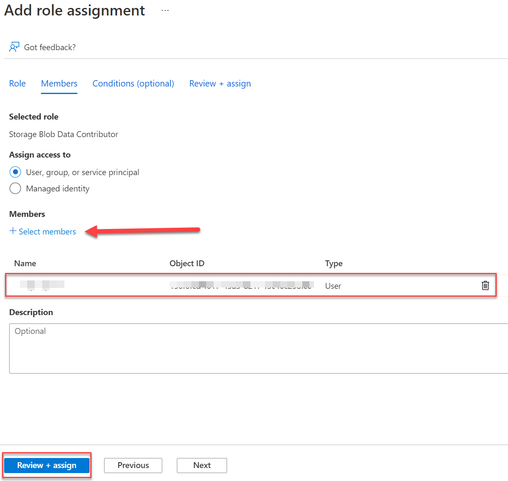

### Task 2: Ingest dataset into a Spark table

This task demonstrates ingesting CSV data and storing the results as a Spark table.

1. In Synapse Studio, select the **Develop** hub from the left menu.

2. Expand the **+** menu on the Develop menu, and select **Notebook**.

    

3. In the Notebook toolbar, expand the **Attach to** drop down and select **sparkpool01**.

    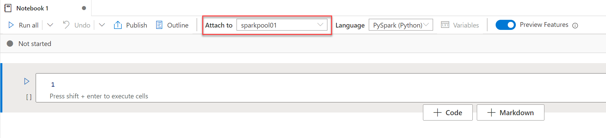

4. In the first cell of the notebook, copy and paste the following code to read the CSV data and display a preview of the data:

    ```python
    import pandas as pd

    df = pd.read_csv('https://automlsamplenotebookdata.blob.core.windows.net/automl-sample-notebook-data/machineData.csv')

    display(df)
    ```

5. Execute the cell by selecting the triangular play button in the cell margin. Please note that it takes a few minutes for a Spark cluster to be provisioned when the first cell is executed. Please note that it is safe to ignore the warning message displayed at the bottom of the output.

    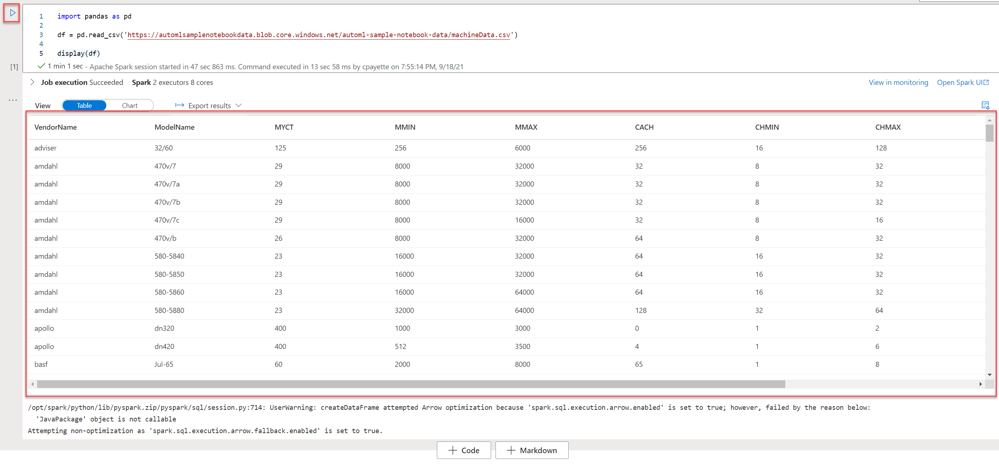

6. Beneath the first cell, select the **+ Code** button to add a new cell. Copy and paste the following code to create a Spark database and table for the training data, then, execute the cell.

    ```python
    spark.sql("CREATE DATABASE research_development")

    sparkdf = spark.createDataFrame(df)

    sparkdf.write.saveAsTable("research_development.compute_module_data")
    ```

    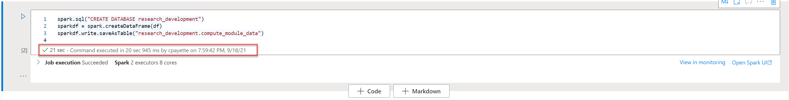

7. Close the notebook document and select the **Close + discard changes** button. There isn't a need to save this notebook.

## Exercise 3: Train a regression model

Contoso Hardware Research and Development has been tasked with training a model that will predict a compute module's estimated relative performance (ERP) based on a series of features. The dataset that has been provided is a labeled dataset; the ERP value for each compute module listed in the file is known along with its corresponding attribute values. In the previous exercise, this training data was ingested into a Spark table. In this exercise, the Spark table is used to train a regression model to predict the ERP value for future hardware.

### Task 1: Create new AutoML experiment using the AML Integration with Azure Synapse Analytics

Contoso Hardware would like to streamline the process of identifying a suitable machine learning algorithm. To do this, they will leverage the AutoML capabilities in Azure Machine Learning that will evaluate multiple algorithms in parallel to determine the best fit. Furthermore, the AML integration with Azure Synapse Analytics also eases the generation of the AutoML experiment. In this task, an AutoML experiment is created on the provided dataset to obtain a regression model to predict the ERP value.

1. In Synapse Studio, select the **Data** hub from the left menu.

2. Remaining on the **Workspace** tab, hover over the **Databases** header, then select the ellipsis button that appears to the right of the heading and select the **Refresh** button.

3. Once refreshed, the **research_development (Spark)** database is visible.

4. Expand the **research_development** database, and its **Tables** folder to reveal the **compute_module_data** table.

    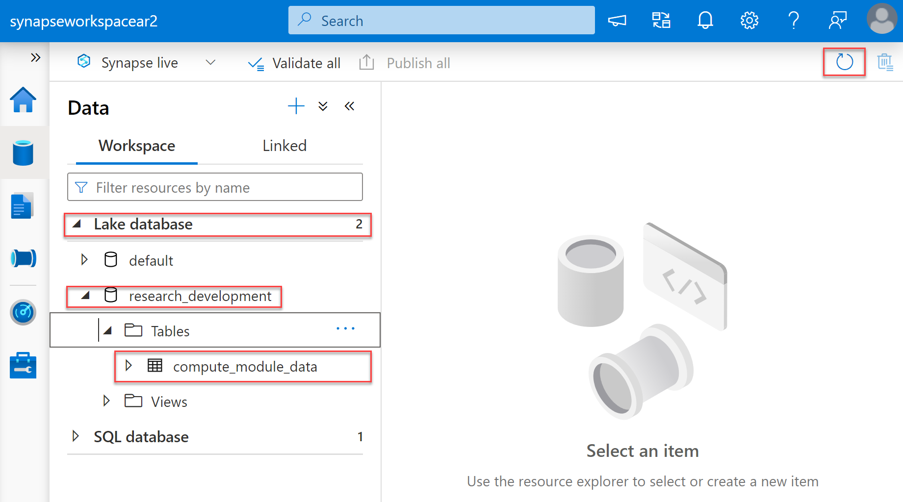

5. Hover over the **compute_module_data** table, select the ellipsis button and choose **Machine Learning**, then **Train a new model**.

    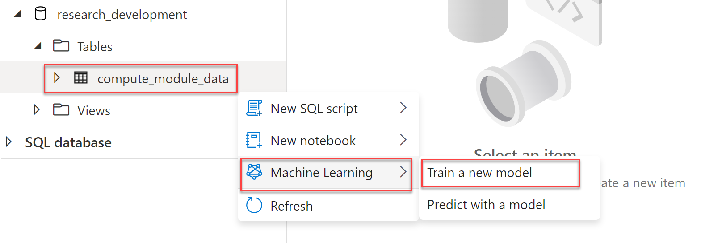

6. In the Train a new model blade, select **Regression**, then select **Continue**.

    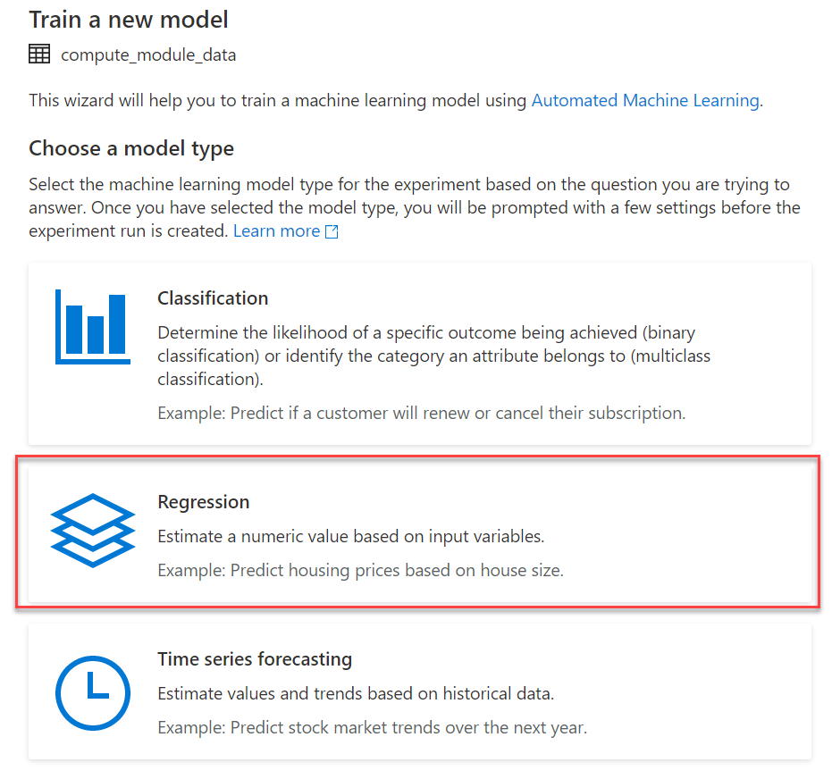

7. In the Train a new model - Configure experiment blade, populate the form as follows and select **Continue**:

    | Field | Value |
    |-------|-------|
    | Azure Machine Learning Workspace | amlworkspace{SUFFIX} |
    | Experiment name | leave default value |
    | Best model name | leave default value |
    | Target column | ERP (long) |
    | Apache Spark pool | sparkpool01 |

    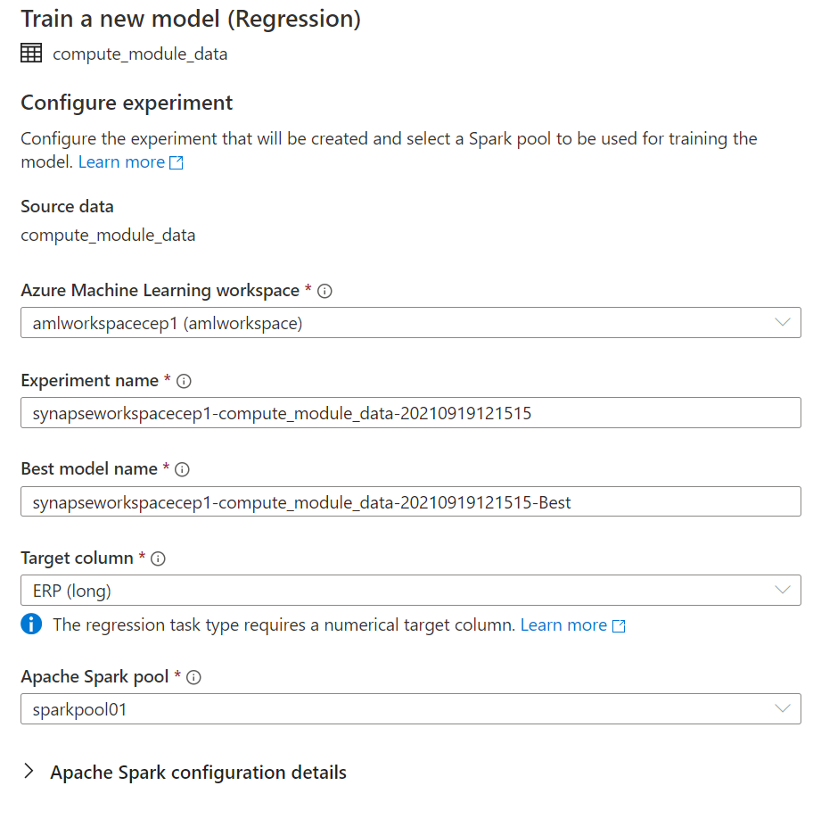

8. In the Train a new model - Configure regression model, populate the form as follows, then select **Open in notebook**.

    | Field | Value |
    |-------|-------|
    | Primary metric | Normalized root mean squared error |
    | Maximum training job time (hours) | 0.3 |
    | Max concurrent iterations | 4 |
    | ONNX model compatibility | Enable |

    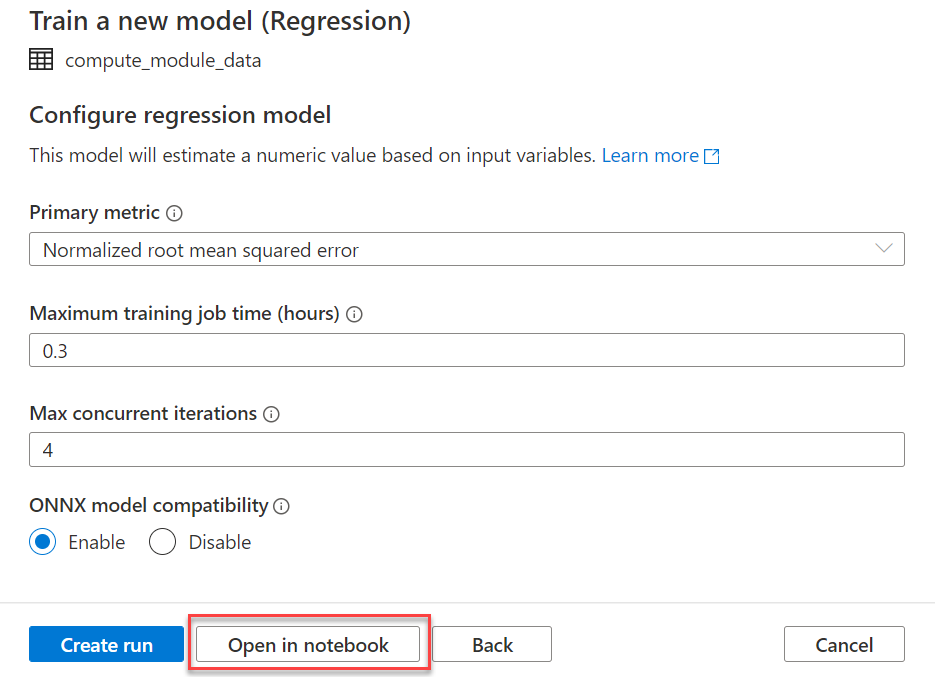

9. A new Notebook is generated and is populated with the code that leverages the integration with Azure Machine Learning to create and run the experiment. From the Notebook toolbar, select the **Run all** button to execute the notebook.

    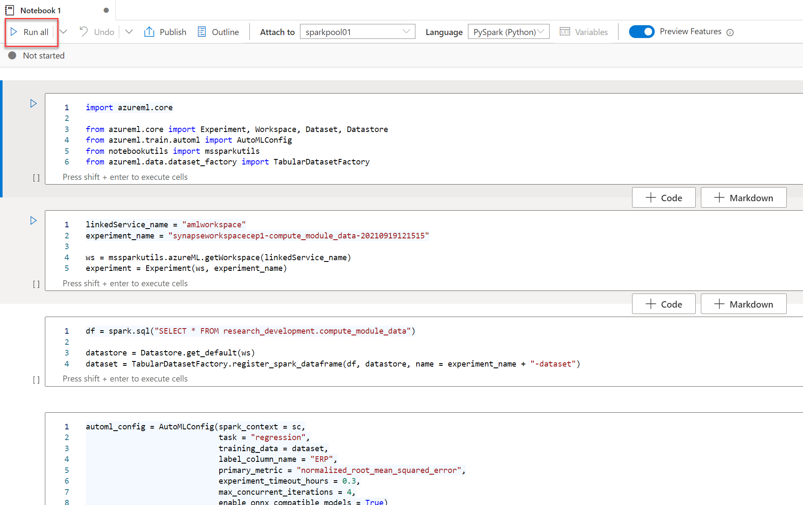

10. Once the 6th cell executes, the output displays a URL into the experiment in the Azure Machine Learning portal. Select this link to watch the experiment progress if desired.

    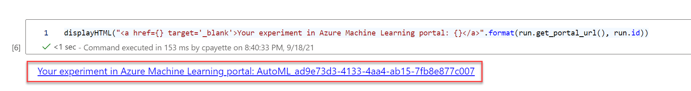

11. The experiment runs in the 7th (and last) cell. This cell will take approximately 30 minutes to complete. Please remain patient and let the notebook execution complete uninterrupted. Grab a snack and refreshment!

    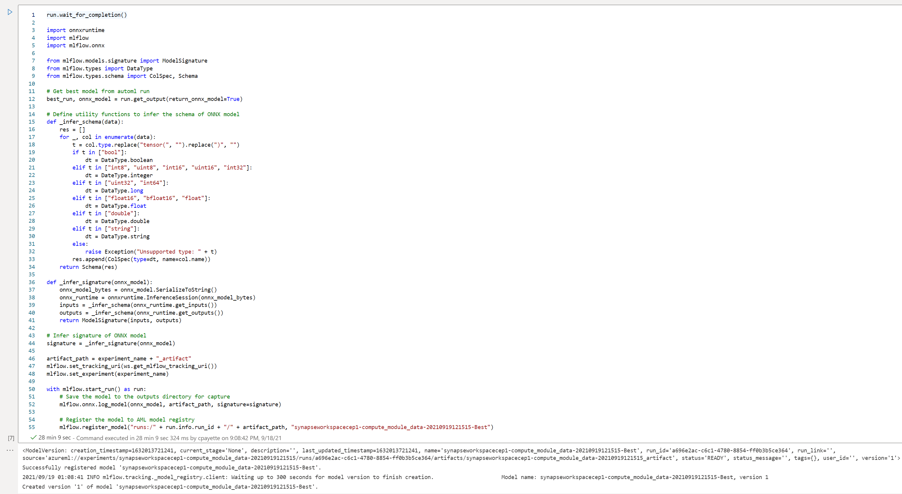

12. Keep this notebook open once execution completes.

### Task 2: View details of the experiment run in AML Studio

The results of the Automated Machine Learning experiment has completed and the best fit model has been identified. The notebook output from the previous task shows the best model having been registered with MLFlow. Access the Azure Machine Learning environment to view full details of the run.

1. In the output of Cell 6, select the link to access the experiment in the Azure Machine Learning workspace.

    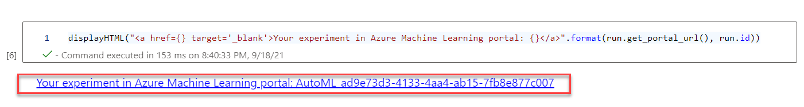

2. In Azure Machine Learning Studio, the details of the run are displayed along with the identified best model.

    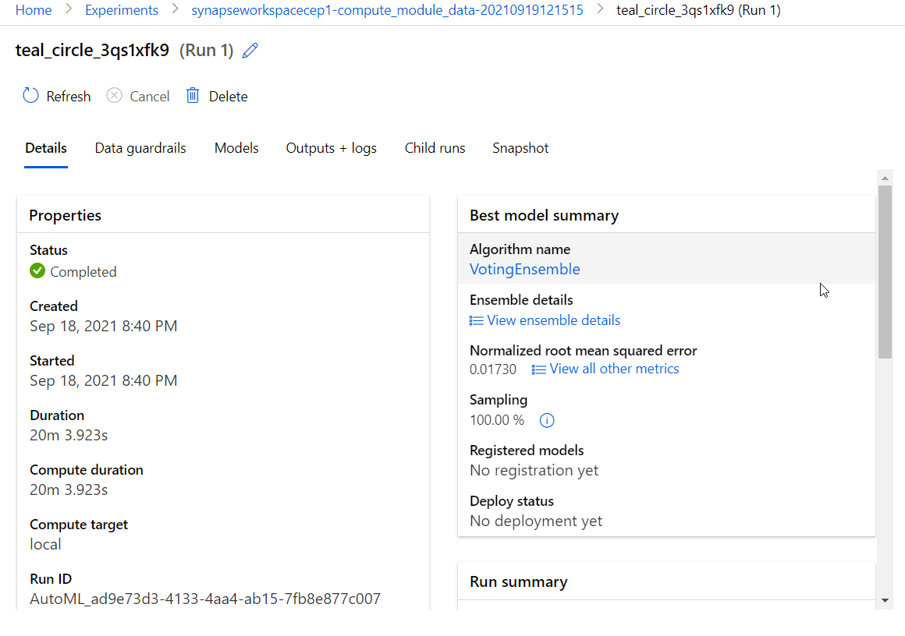

3. Beneath the **Best model summary** heading, select the **Algorithm Name** link.

    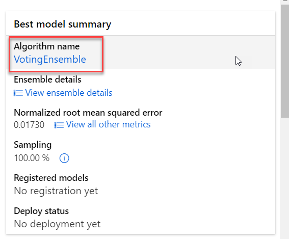

4. On the model screen, select the **Explanations** tab. If not already selected, choose the **Aggregate feature importance** section. The chart displayed shows the most influential features in the determination of the predicted value. In this case, the MMAX and PRP values are the most influential.

    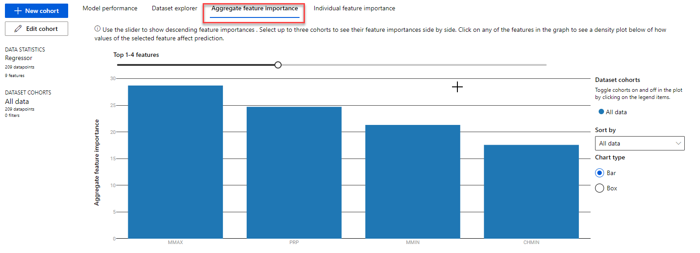

5. In cell 7 of the notebook, the best model is registered using MLFlow. To view the registered model, select the **Models** item from the left menu of the Azure Machine Learning Studio interface.

    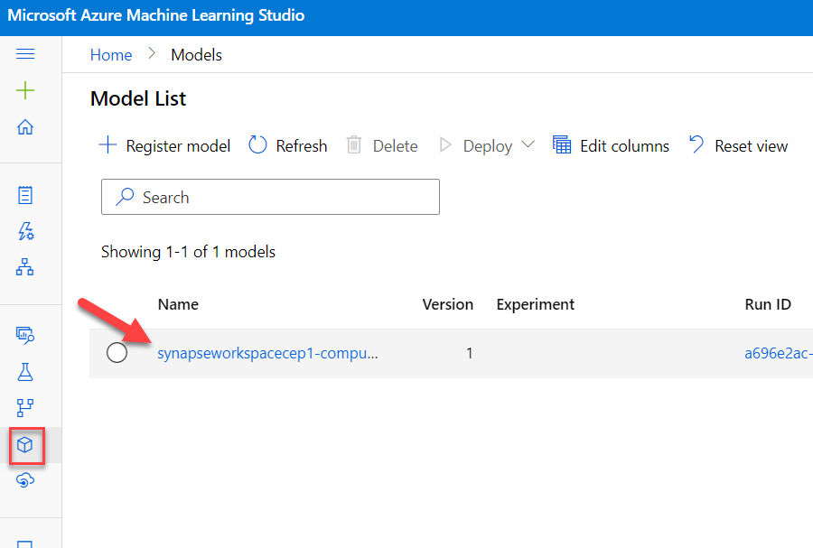

## Exercise 4: Consume the trained regression model

Now that the best regression model has been trained and identified, it is now ready for use. Contoso Hardware has received benchmark data for prospective compute modules. This data is available as a table in the dedicated SQL Pool of Azure Synapse Analytics. In this exercise, the regression model enhances the data obtained for the prospective hardware and predicts the ERP value.

### Task 1: Load prospective compute module data

1. In Synapse Studio, select the **Develop** hub from the left menu. Expand the **+** menu item and choose **SQL script**.

    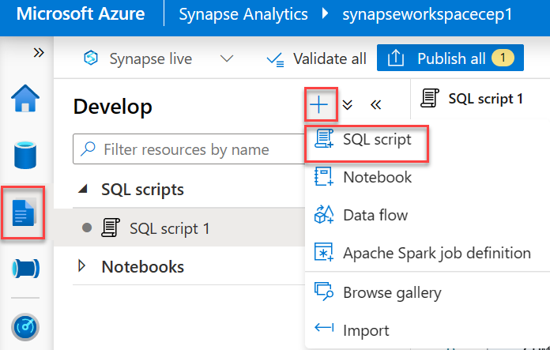

2. In the query window toolbar, choose **sqlpool01** in the **Connect to** field.

3. In the query window, paste then run the following script to create the PROPOSED_HARDWARE table in the SQL pool. Please note that the ERP field is filled with a zero value. This field will be populated by the value returned from the trained regression model.

    ```sql
    CREATE TABLE PROPOSED_HARDWARE (
        VendorName varchar(20),
        ModelName varchar(20),
        MYCT bigint,
        MMIN bigint,
        MMAX bigint,
        CACH bigint,
        CHMIN bigint,
        CHMAX bigint,
        PRP bigint,
        ERP bigint
    );

    INSERT INTO PROPOSED_HARDWARE VALUES ('amdahl','470v/b',26,8000,32000,64,8,32,318,0);
    INSERT INTO PROPOSED_HARDWARE VALUES ('cdc', 'omega:480-ii',50,1000,4000,8,1,5,29,0);
    INSERT INTO PROPOSED_HARDWARE VALUES ('cdc','omega:480-iii',50,2000,8000,8,1,5,71,0);
    INSERT INTO PROPOSED_HARDWARE VALUES ('dec','vax:11/730',810,1000,5000,0,1,1,20,0);
    INSERT INTO PROPOSED_HARDWARE VALUES ('dec','vax:11/750',320,512,8000,4,1,5,40,0);
    INSERT INTO PROPOSED_HARDWARE VALUES ('dec','vax:11/780',200,512,8000,8,1,8,62,0);
    INSERT INTO PROPOSED_HARDWARE VALUES ('honeywell','dps:8/62',140,2000,32000,32,1,54,189,0);
    INSERT INTO PROPOSED_HARDWARE VALUES ('honeywell','dps:8/20',140,2000,4000,8,1,20,22,0);
    INSERT INTO PROPOSED_HARDWARE VALUES ('magnuson','m80/32',100,1000,8000,24,3,6,32,0);
    INSERT INTO PROPOSED_HARDWARE VALUES ('magnuson','m80/42',50,2000,16000,12,3,16,45,0);
    ```

    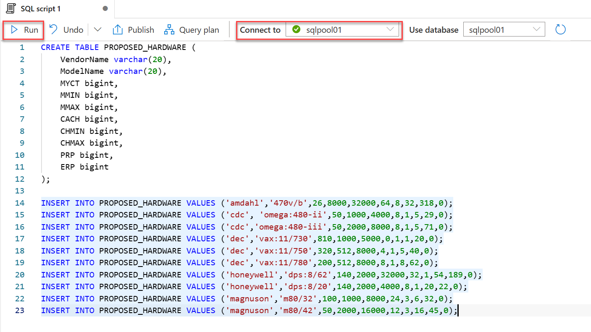

4. Close the query window and discard the changes.

### Task 2: Enrich research and development SQL table with the trained model

The proposed hardware data is loaded into the SQL pool, and the ERP value for all entries is set to 0 and is ready to be predicted by the model.

1. In Synapse Studio, select the **Data** hub from the left menu. Expand the **Databases** header, then the **sqlpool01** database. Expand the **Tables** folder to reveal the `PROPOSED_HARDWARE` table that was populated in the previous task.

    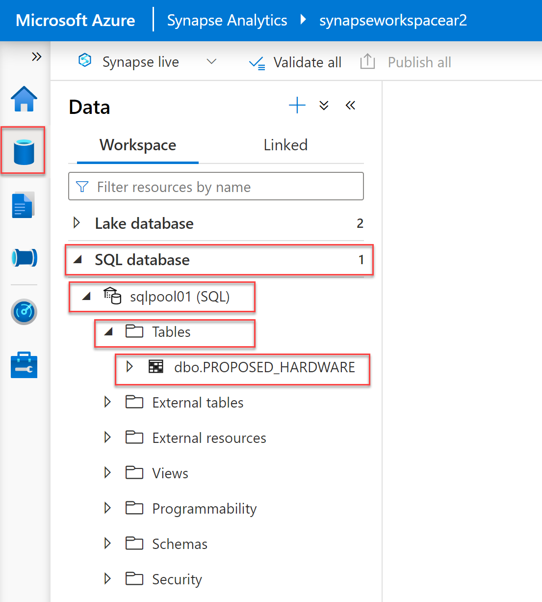

2. Hover over the `PROPOSED_HARDWARE` table and select the ellipsis to reveal the Actions menu. Expand the **Machine Learning** option, and choose **Predict with a model**.

    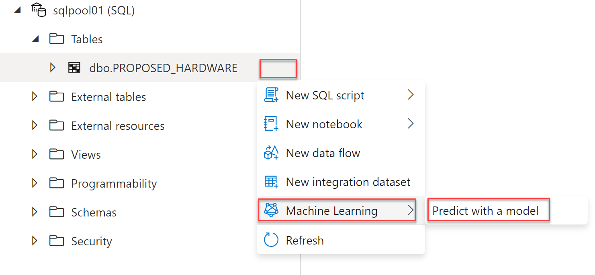

3. On the **Predict with a model** blade, select the lab Azure Machine Learning workspace. This will populate the registered model in a table below the workspace selection. This is the regression model that was trained and registered earlier in the lab. Select this model from the listing, and choose **Continue**.

    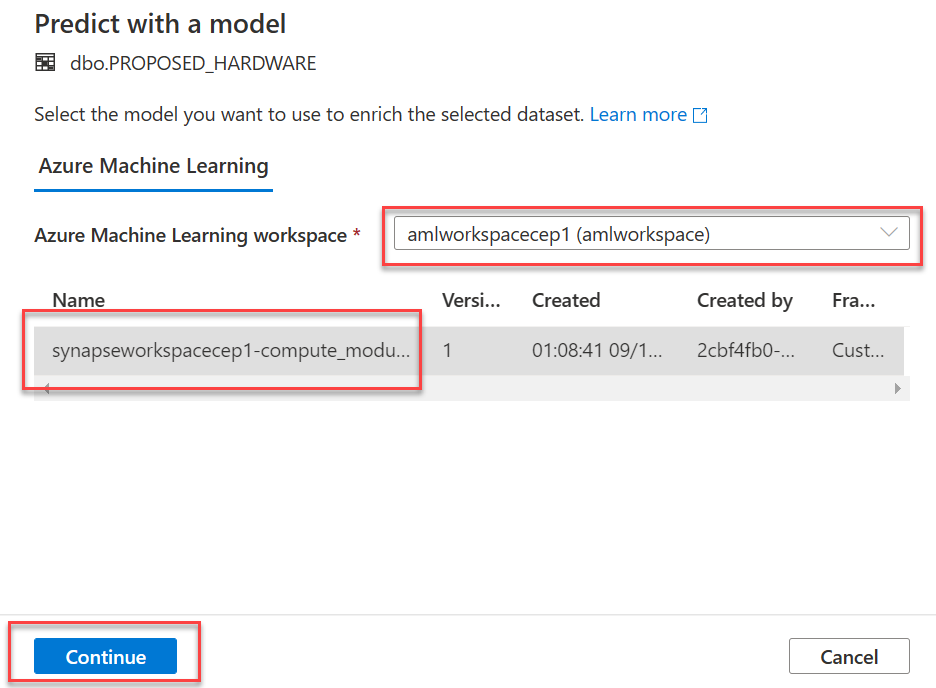

4. On the input/output mapping blade, the input mapping is pre-populated as the fields in the table match the model input. In the Output mapping, modify the value to specify **ERP** with the output type **bigint**. Select **Continue**.

    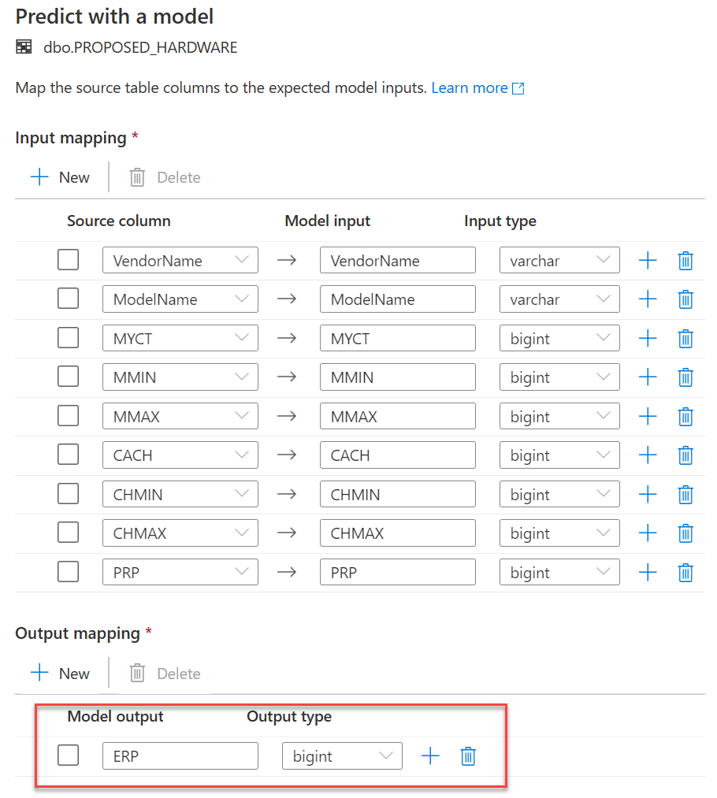

5. In the **Stored procedure** blade, populate the form as follows, then select **Deploy model + open script**. Deployment will take a few moments.

    | Field | Value |
    |-------|-------|
    | Stored procedure name | [dbo].[predictERP] |
    | Select target table | Create new |
    | New table | [dbo].[models] |

    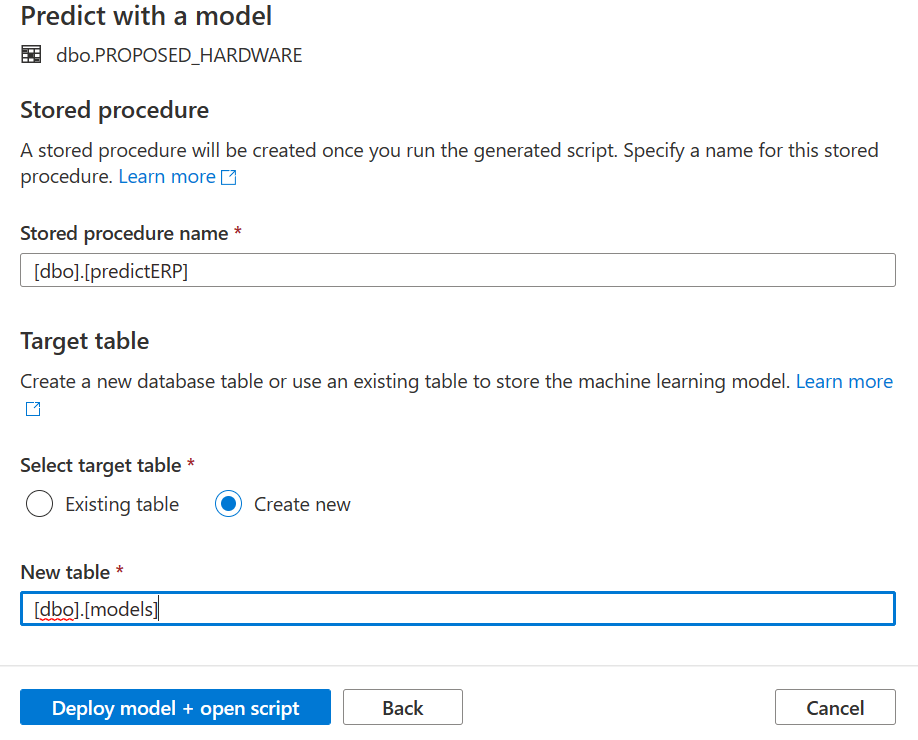

6. In the script window, copy the value of the model id and store it in a text editor.

   

7. The T-SQL code that is generated will only return the results of the prediction, without actually saving them. Replace the script with the following, be sure to replace the **{MODEL ID GOES HERE}** value. Please note that the **MERGE** statement may show a syntax problem in the user interface, this is not the case and can be safely ignored.

    ```sql
    ALTER PROCEDURE [dbo].[predictERP]
    AS
    BEGIN
        --retrieve the rows where ERP is not populated
        SELECT VendorName, ModelName, MYCT, MMIN, MMAX, CACH, CHMIN, CHMAX, PRP
        INTO #predicterp
        FROM [dbo].[PROPOSED_HARDWARE]
        WHERE ERP = 0;

        SELECT VendorName, ModelName, MYCT, MMIN, MMAX, CACH, CHMIN, CHMAX, PRP, CAST(variable_out1 as bigint) as ERP
        INTO #pred
        FROM PREDICT (MODEL = (SELECT [model] FROM [dbo].[models] WHERE [ID] = '{MODEL ID GOES HERE}'),
                    DATA = #predicterp,
                    RUNTIME = ONNX) WITH ([variable_out1] [real])
        MERGE [dbo].[PROPOSED_HARDWARE] as target
            USING (select * from #pred) as source (VendorName, ModelName, MYCT, MMIN, MMAX, CACH, CHMIN, CHMAX, PRP, ERP)
        ON
            (target.VendorName = source.VendorName and target.ModelName = source.ModelName and target.MYCT = source.MYCT
            and target.MMIN = source.MMIN and target.MMAX = source.MMAX and target.CACH = source.CACH and target.CHMIN = source.CHMIN
            and target.CHMAX = source.CHMAX and target.PRP = source.PRP)  
            WHEN MATCHED THEN
                UPDATE SET target.ERP = source.ERP;
    END
    GO
    ```

    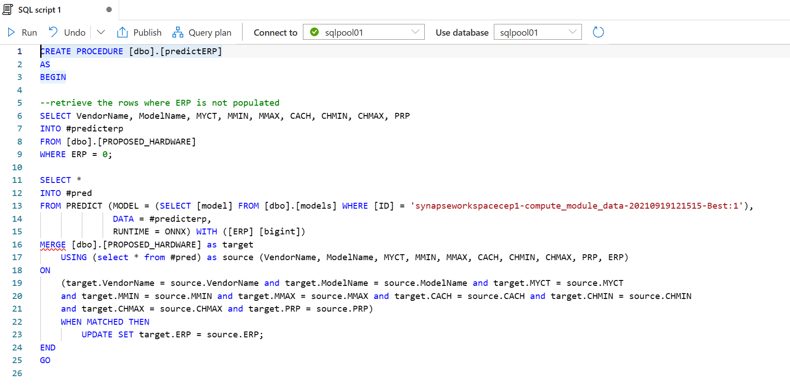

8. Clear the SQL script text, and execute the following to populate the ERP value in the PROPOSED_HARDWARE table. Notice how the ERP column is now a non-zero value.

    ```sql
    EXEC [dbo].[predictERP]
    SELECT * from [dbo].[PROPOSED_HARDWARE]
    ```

    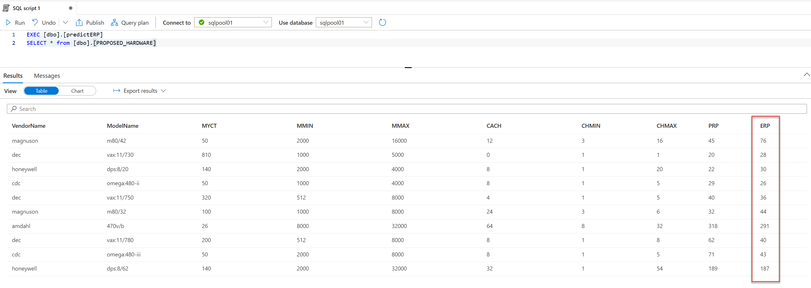

## Conclusion

This lab leveraged the integration of Azure Synapse Analytics and Azure Machine Learning to evaluate multiple regression algorithms. The best fit model was identified and used to enhance the prospective hardware table using the SQL PREDICT statement encapsulated in a stored procedure.
